# Laporan Praktikum #10 - Dasar State Management

## Identitas Mahasiswa

| Atribut | Nilai                       |
| ------- | -----                       |
| Nama    | Fiza Rahmatus Sholikha      |
| NIM     | 244107060109                |
| Kelas   | SIB-2E                      |

[LINK REPOSITORY KODE PRAKTIKUM](https://github.com/Fizzrss/master_plan)

---

## Praktikum 1: Dasar State dengan Model-View

### Langkah 1: Buat Project Baru

Buatlah sebuah project flutter baru dengan nama master_plan di folder src week-10 repository GitHub Anda atau sesuai style laporan praktikum yang telah disepakati. Lalu buatlah susunan folder dalam project seperti gambar berikut ini.

.png)

.png)

### Langkah 2: Membuat model task.dart

Praktik terbaik untuk memulai adalah pada lapisan data (data layer). Ini akan memberi Anda gambaran yang jelas tentang aplikasi Anda, tanpa masuk ke detail antarmuka pengguna Anda. Di folder model, buat file bernama task.dart dan buat class Task. Class ini memiliki atribut description dengan tipe data String dan complete dengan tipe data Boolean, serta ada konstruktor. Kelas ini akan menyimpan data tugas untuk aplikasi kita. Tambahkan kode berikut:

.png)

.png)

### Langkah 3: Buat file plan.dart

Kita juga perlu sebuah List untuk menyimpan daftar rencana dalam aplikasi to-do ini. Buat file plan.dart di dalam folder models dan isi kode seperti berikut.

.png)

.png)

### Langkah 4: Buat file data_layer.dart

Kita dapat membungkus beberapa data layer ke dalam sebuah file yang nanti akan mengekspor kedua model tersebut. Dengan begitu, proses impor akan lebih ringkas seiring berkembangnya aplikasi. Buat file bernama data_layer.dart di folder models. Kodenya hanya berisi export seperti berikut.

.png)

.png)

### Langkah 5: Pindah ke file main.dart

Ubah isi kode main.dart sebagai berikut.

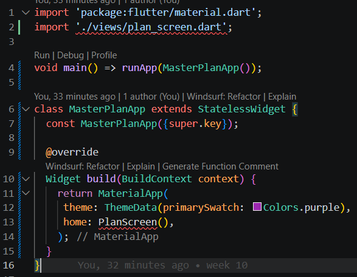

### Langkah 6: buat plan_screen.dart

Pada folder views, buatlah sebuah file plan_screen.dart dan gunakan templat StatefulWidget untuk membuat class PlanScreen. Isi kodenya adalah sebagai berikut. Gantilah teks ‘Namaku' dengan nama panggilan Anda pada title AppBar.

.png)

.png)

### Langkah 7: buat method _buildAddTaskButton()

Anda akan melihat beberapa error di langkah 6, karena method yang belum dibuat. Ayo kita buat mulai dari yang paling mudah yaitu tombol Tambah Rencana. Tambah kode berikut di bawah method build di dalam class _PlanScreenState.

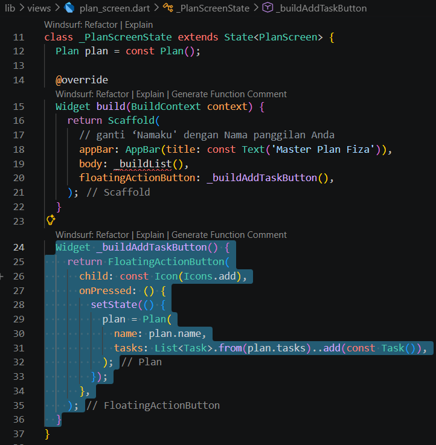

### Langkah 8: buat widget _buildList()

Kita akan buat widget berupa List yang dapat dilakukan scroll, yaitu ListView.builder. Buat widget ListView seperti kode berikut ini.

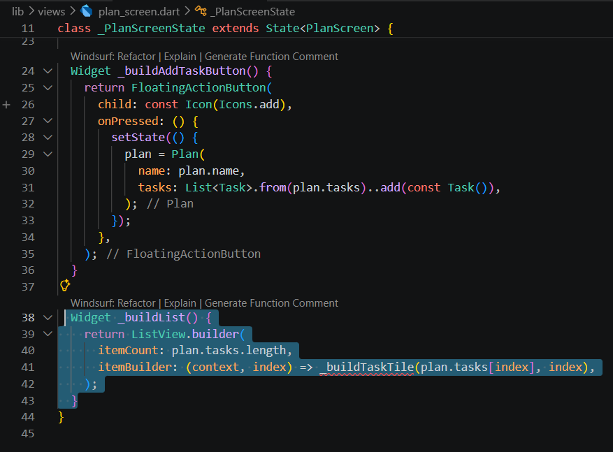

### Langkah 9: buat widget _buildTaskTile

Dari langkah 8, kita butuh ListTile untuk menampilkan setiap nilai dari plan.tasks. Kita buat dinamis untuk setiap index data, sehingga membuat view menjadi lebih mudah. Tambahkan kode berikut ini.

.png)

Run atau tekan F5 untuk melihat hasil aplikasi yang Anda telah buat. Capture hasilnya untuk soal praktikum nomor 4.

### Langkah 10: Tambah Scroll Controller

Anda dapat menambah tugas sebanyak-banyaknya, menandainya jika sudah beres, dan melakukan scroll jika sudah semakin banyak isinya. Namun, ada salah satu fitur tertentu di iOS perlu kita tambahkan. Ketika keyboard tampil, Anda akan kesulitan untuk mengisi yang paling bawah. Untuk mengatasi itu, Anda dapat menggunakan ScrollController untuk menghapus focus dari semua TextField selama event scroll dilakukan. Pada file plan_screen.dart, tambahkan variabel scroll controller di class State tepat setelah variabel plan.

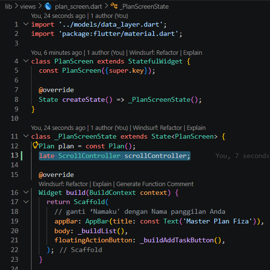

### Langkah 11: Tambah Scroll Listener

Tambahkan method initState() setelah deklarasi variabel scrollController seperti kode berikut.

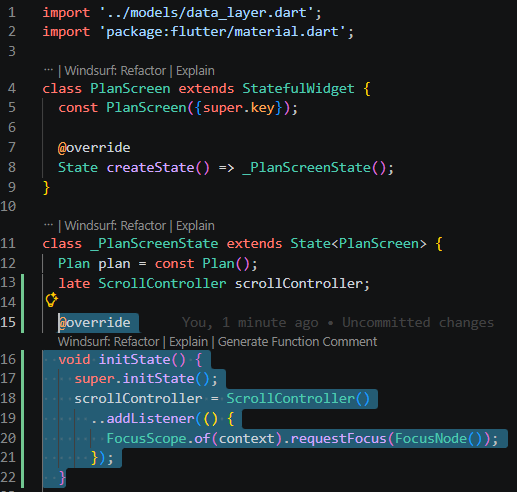

### Langkah 12: Tambah controller dan keyboard behavior

Tambahkan controller dan keyboard behavior pada ListView di method _buildList seperti kode berikut ini.

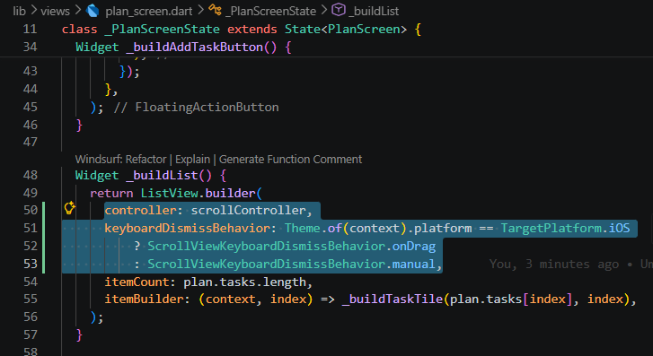

### Langkah 13: Terakhir, tambah method dispose()

Terakhir, tambahkan method dispose() berguna ketika widget sudah tidak digunakan lagi.

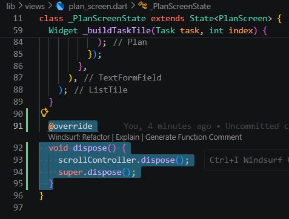

### Langkah 14: Hasil

Lakukan Hot restart (bukan hot reload) pada aplikasi Flutter Anda. Anda akan melihat tampilan akhir seperti gambar berikut. Jika masih terdapat error, silakan diperbaiki hingga bisa running.

**Perbaikan code karena terdapat bug seperti ketika list terakhir keyboard tidak bisa muncul**

.png)

**Hasil run**

>Catatan: Kedua fitur hot reload dan hot restart memiliki performa lebih cepat dibanding melakukan build ulang secara keseluruhan aplikasi. Secara umum:
>- Gunakan hot reload untuk melihat perubahan pada tampilan UI, jadi perubahan paling banyak terjadi di metode build. State pada aplikasi tetap dipertahankan dan Anda akan melihat perubahannya hampir secara instan.
>- Gunakan hot restart untuk melihat perubahan pada state aplikasi, seperti memperbarui variabel global, static fields, atau metode main(). Kondisi app state akan reset (kembali seperti awal).

---

## Tugas Praktikum 1: Dasar State dengan Model-View

### 1. Selesaikan langkah-langkah praktikum tersebut, lalu dokumentasikan berupa GIF hasil akhir praktikum beserta penjelasannya di file README.md! Jika Anda menemukan ada yang error atau tidak berjalan dengan baik, silakan diperbaiki.

### 2. Jelaskan maksud dari langkah 4 pada praktikum tersebut! Mengapa dilakukan demikian?

*jawab:*

langkah 4 bertujuan untuk mengimplementasikan teknik barrel export, yaitu menggabungkan beberapa file model seperti plan.dart dan task.dart ke dalam satu file pusat bernama data_layer.dart. Dengan cara ini, proses impor di file lain menjadi lebih sederhana dan efisien karena cukup menggunakan satu baris impor untuk mengakses berbagai model sekaligus. Metode ini juga membantu dalam pemeliharaan kode ketika aplikasi semakin kompleks, serta menjaga struktur data layer tetap teratur tanpa harus mengimpor setiap file model secara terpisah.

### 3. Mengapa perlu variabel plan di langkah 6 pada praktikum tersebut? Mengapa dibuat konstanta?

*jawab:*

Variabel plan berperan sebagai state lokal yang digunakan untuk menyimpan data daftar rencana atau tasks yang khusus ditampilkan pada layar tersebut. Karena PlanScreen merupakan StatefulWidget, nilai dari variabel ini akan terus berubah, misalnya saat pengguna menambahkan atau mencentang tugas, sehingga UI dapat ikut diperbarui (rebuild). Variabel ini diinisialisasi dengan nilai konstanta (const Plan()) untuk meningkatkan efisiensi penggunaan memori. Best practice nya dengan cara memberikan nilai awal berupa const pada objek yang masih kosong untuk membantu menghindari alokasi memori yang tidak perlu setiap kali widget pertama kali ditampilkan.

### 4. Lakukan capture hasil dari Langkah 9 berupa GIF, kemudian jelaskan apa yang telah Anda buat!

*jawab:*

.gif)

**penjelasan:**

Pada praktikum ini membuat fondasi awal sekaligus antarmuka interaktif untuk aplikasi To-Do List (Master Plan) sederhana. Tahap awal dimulai dengan menyiapkan data layer melalui pembuatan model Task dan Plan agar struktur data lebih terorganisir. Selanjutnya, layar utama (PlanScreen) dibuat dengan menggunakan StatefulWidget sehingga tampilan dapat berubah sesuai dengan interaksi pengguna. Pada tahap akhir, elemen UI disusun dengan menambahkan tombol tambah (FloatingActionButton) untuk memasukkan tugas baru, ListView untuk menampilkan daftar tugas secara dinamis, dan kombinasi Checkbox dan TextFormField agar bisa menulis sekaligus menandai tugas yang telah selesai. Seluruh interaksi tersebut dikelola menggunakan setState(), sehingga setiap perubahan data akan langsung memicu pembaruan tampilan secara otomatis.

Cara kerja aplikasi ini dengan menekan tombol tambah terlebih dahulu, kemudian sebuah objek tugas baru ditambahkan ke dalam memori, yang secara otomatis memicu layar untuk menggambar ulang dan memunculkan baris tugas baru pada daftar (ListView). Selanjutnya, setiap ketikan pada kolom teks maupun klik pada checkbox akan langsung ditangkap oleh aplikasi untuk memperbarui nilai deskripsi dan status penyelesaian tugas tersebut secara real-time.

### 5. Apa kegunaan method pada Langkah 11 dan 13 dalam lifecyle state?

*jawab:*

Dalam lifecyle state pada Fullter, method initState() di langkah 11 berperan sebagai proses inisialisasi awal yang hanya dipanggil satu kali ketika widget pertama kali dimuat ke dalam memori. Pada tahap ini, objek ScrollController dibuat sekaligus diatur dengan listener agar keyboard bisa tertutup otomatis saat pengguna melakukan scroll.

Sementara itu, method dispose() pada langkah 13 merupakan tahap akhir dalam siklus hidup widget yang dijalankan ketika widget sudah tidak digunakan dan dihapus dari layar. Pemanggilan dispose() sangat penting untuk membersihkan objek controller dari memori, sehingga sumber daya dapat dilepaskan dengan baik dan aplikasi terhindar dari potensi memory leak.

### 6. Kumpulkan laporan praktikum Anda berupa link commit atau repository GitHub ke dosen yang telah disepakati!

---

## Praktikum 2: Mengelola Data Layer dengan InheritedWidget dan InheritedNotifier

### Langkah 1: Buat file plan_provider.dart

Buat folder baru provider di dalam folder lib, lalu buat file baru dengan nama plan_provider.dart berisi kode seperti berikut.

.png)

.png)

### Langkah 2: Edit main.dart

Gantilah pada bagian atribut home dengan PlanProvider seperti berikut. Jangan lupa sesuaikan bagian impor jika dibutuhkan.

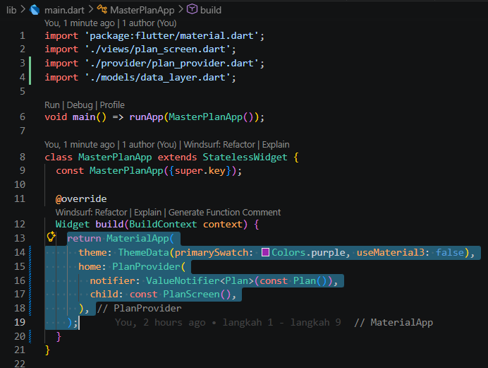

### Langkah 3: Tambah method pada model plan.dart

Tambahkan dua method di dalam model class Plan seperti kode berikut.

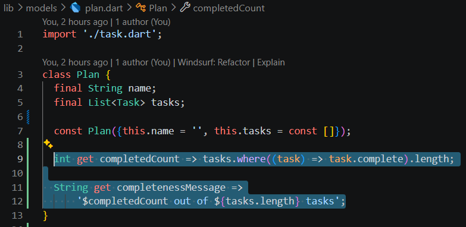

### Langkah 4: Pindah ke PlanScreen

Edit PlanScreen agar menggunakan data dari PlanProvider. Hapus deklarasi variabel plan (ini akan membuat error). Kita akan perbaiki pada langkah 5 berikut ini.

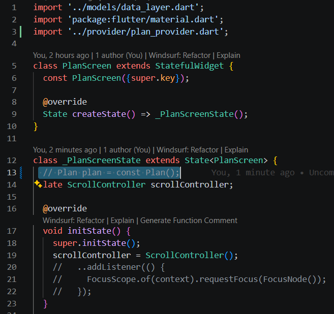

### Langkah 5: Edit method _buildAddTaskButton

Tambahkan BuildContext sebagai parameter dan gunakan PlanProvider sebagai sumber datanya. Edit bagian kode seperti berikut.

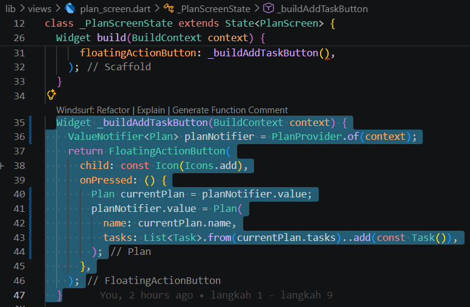

### Langkah 6: Edit method _buildTaskTile

Tambahkan parameter BuildContext, gunakan PlanProvider sebagai sumber data. Ganti TextField menjadi TextFormField untuk membuat inisial data provider menjadi lebih mudah.

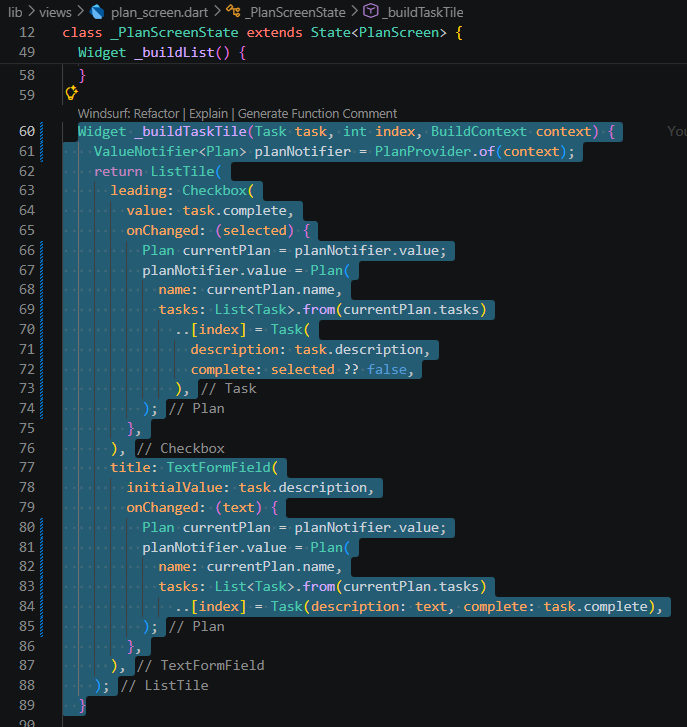

### Langkah 7: Edit _buildList

Sesuaikan parameter pada bagian _buildTaskTile seperti kode berikut.

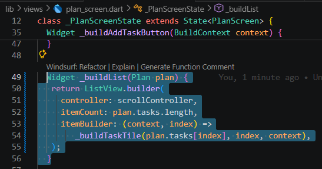

### Langkah 8: Tetap di class PlanScreen

Edit method build sehingga bisa tampil progress pada bagian bawah (footer). Caranya, bungkus (wrap) _buildList dengan widget Expanded dan masukkan ke dalam widget Column seperti kode pada Langkah 9.

### Langkah 9: Tambah widget SafeArea

Terakhir, tambahkan widget SafeArea dengan berisi completenessMessage pada akhir widget Column. Perhatikan kode berikut ini.

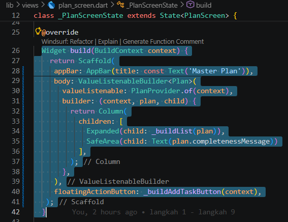

Akhirnya, run atau tekan F5 jika aplikasi belum running. Tidak akan terlihat perubahan pada UI, namun dengan melakukan langkah-langkah di atas, Anda telah menerapkan cara memisahkan dengan baik antara view dan model. Ini merupakan hal terpenting dalam mengelola state di aplikasi Anda.

---

## Tugas Praktikum 2: InheritedWidget

### 1. Selesaikan langkah-langkah praktikum tersebut, lalu dokumentasikan berupa GIF hasil akhir praktikum beserta penjelasannya di file README.md! Jika Anda menemukan ada yang error atau tidak berjalan dengan baik, silakan diperbaiki sesuai dengan tujuan aplikasi tersebut dibuat.

### 2. Jelaskan mana yang dimaksud InheritedWidget pada langkah 1 tersebut! Mengapa yang digunakan InheritedNotifier?

*jawab:*

Pada langkah 1, konsep InheritedWidget diterapkan melalui kelas PlanProvider, yang merupakan turunan dari InheritedNotifier dan secara tidak langsung dari InheritedWidget. Perannya adalah sebagai pusat penyedia data sehingga widget di bawahnya dapat mengakses data tanpa harus mengirim parameter secara manual melalui konstruktor. menggunakan InheritedNotifier karena menggabungkan distribusi data dengan sifat reaktif yang dimana saat data dalam ValueNotifier berubah, widget yang bergantung akan otomatis melakukan rebuild. Dengan demikian, kebutuhan penggunaan setState() secara manual dapat diminimalkan.

### 3. Jelaskan maksud dari method di langkah 3 pada praktikum tersebut! Mengapa dilakukan demikian?

*jawab:*

Penambahan method getter completedCount dan completenessMessage pada langkah 3 bertujuan untuk menghitung jumlah tugas yang dicentang serta menyusunnya menjadi pesan progres dalam bentuk teks. Hal ini merupakan best practice dalam pengembangan perangkat lunak, yaitu memisahkan logika bisnis (model) dari tampilan (view). Dengan pendekatan ini, seluruh proses perhitungan dilakukan di dalam model, sedangkan bagian view hanya berfokus pada menampilkan hasil akhirnya.

### 4. Lakukan capture hasil dari Langkah 9 berupa GIF, kemudian jelaskan apa yang telah Anda buat!

*jawab:*

.gif)

**penjelasan:**

Berdasarkan hasil eksekusi aplikasi pada GIF, aplikasi To-Do List yang dibangun telah memiliki dua bagian utama yaitu daftar tugas yang bisa di-scroll dan indikator progres penyelesaian di bagian bawah layar (footer) dan aplikasi ini juga sudah menerapkan manajemen state terpisah menggunakan arsitektur provider. Setiap kali pengguna menambahkan tugas atau mengubah status checkbox, pembaruan data tidak lagi menggunakan setState(), melainkan dikelola oleh ValueListenableBuilder yang secara otomatis memperbarui tampilan daftar tugas serta teks progres di bagian SafeArea secara real-time.

### 5. Kumpulkan laporan praktikum Anda berupa link commit atau repository GitHub ke dosen yang telah disepakati!

---

## Praktikum 3: Membuat State di Multiple Screens

### Langkah 1: Edit PlanProvider

Perhatikan kode berikut, edit class PlanProvider sehingga dapat menangani List Plan.

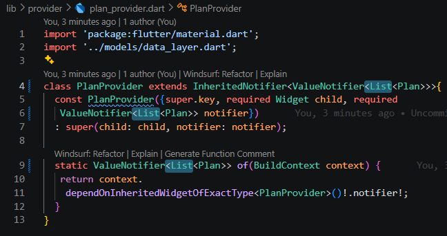

### Langkah 2: Edit main.dart

Langkah sebelumnya dapat menyebabkan error pada main.dart dan plan_screen.dart. Pada method build, gantilah menjadi kode seperti ini.

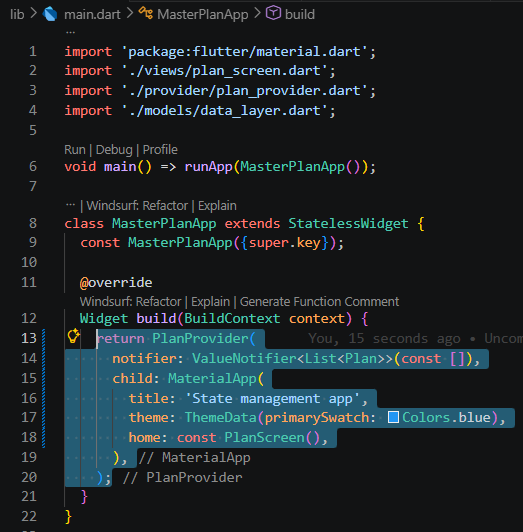

### Langkah 3: Edit plan_screen.dart

Tambahkan variabel plan dan atribut pada constructor-nya seperti berikut.

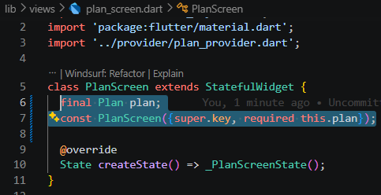

### Langkah 4: Error

Itu akan terjadi error setiap kali memanggil PlanProvider.of(context). Itu terjadi karena screen saat ini hanya menerima tugas-tugas untuk satu kelompok Plan, tapi sekarang PlanProvider menjadi list dari objek plan tersebut.

### Langkah 5: Tambah getter Plan

Tambahkan getter pada _PlanScreenState seperti kode berikut.

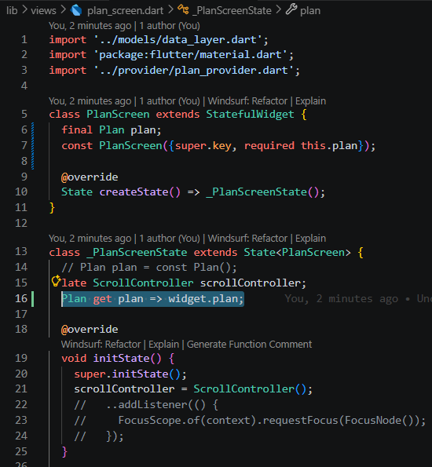

### Langkah 6: Method initState()

Pada bagian ini kode tetap seperti berikut.

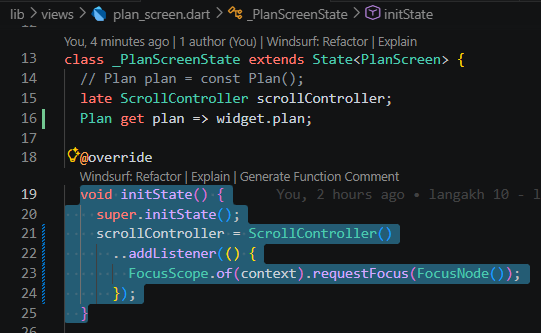

### Langkah 7: Widget build

Pastikan Anda telah merubah ke List dan mengubah nilai pada currentPlan seperti kode berikut ini.

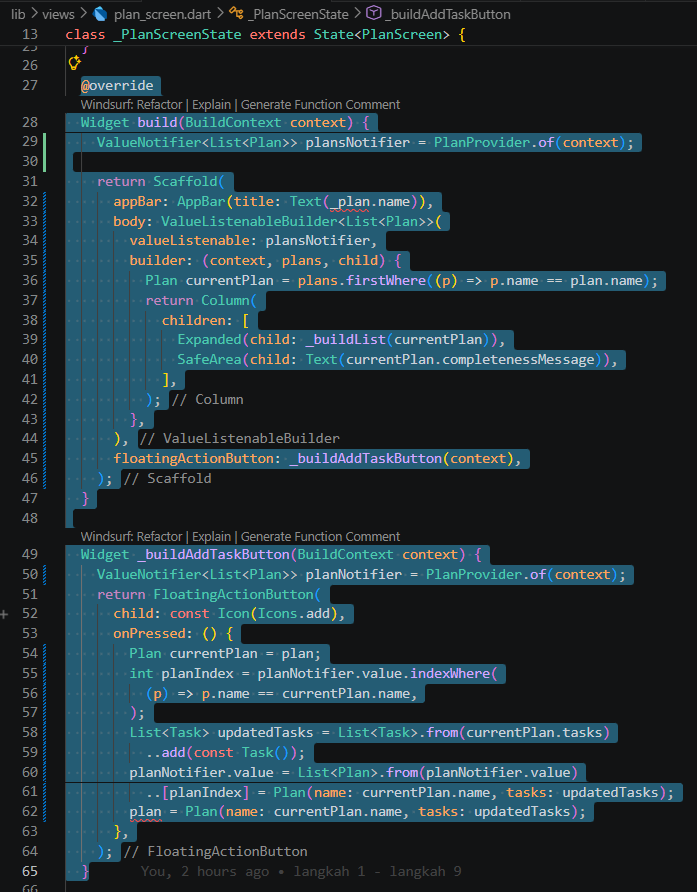

**perbaikan kode**

.png)

### Langkah 8: Edit _buildTaskTile

Pastikan ubah ke List dan variabel planNotifier seperti kode berikut ini.

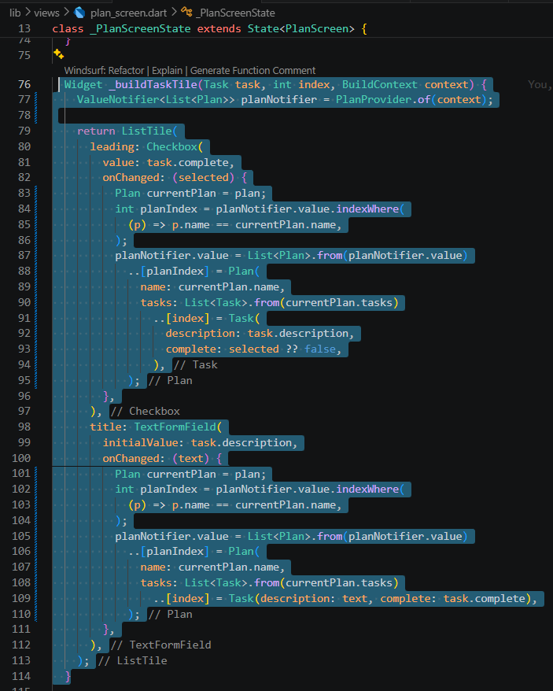

### Langkah 9: Buat screen baru

Pada folder view, buatlah file baru dengan nama plan_creator_screen.dart dan deklarasikan dengan StatefulWidget bernama PlanCreatorScreen. Gantilah di main.dart pada atribut home menjadi seperti berikut.

.png)

.png)

.png)

### Langkah 10: Pindah ke class _PlanCreatorScreenState

Kita perlu tambahkan variabel TextEditingController sehingga bisa membuat TextField sederhana untuk menambah Plan baru. Jangan lupa tambahkan dispose ketika widget unmounted seperti kode berikut.

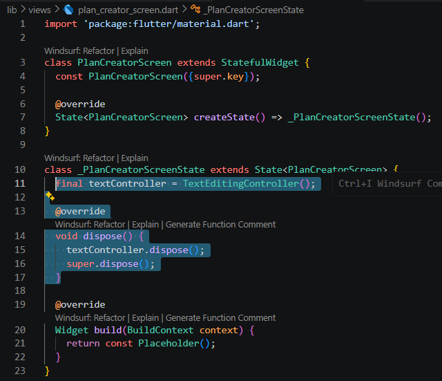

### Langkah 11: Pindah ke method build

Letakkan method Widget build berikut di atas void dispose. Gantilah ‘Namaku' dengan nama panggilan Anda.

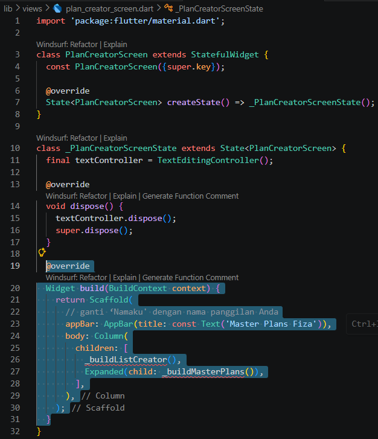

### Langkah 12: Buat widget _buildListCreator

Buatlah widget berikut setelah widget build.

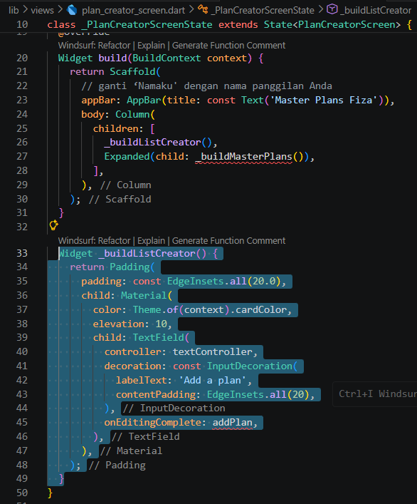

### Langkah 13: Buat void addPlan()

Tambahkan method berikut untuk menerima inputan dari user berupa text plan.

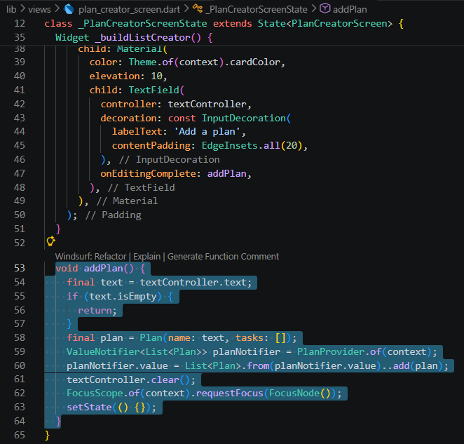

.png)

### Langkah 14: Buat widget _buildMasterPlans()

Tambahkan widget seperti kode berikut.

.png)

.png)

Terakhir, run atau tekan F5 untuk melihat hasilnya jika memang belum running. Bisa juga lakukan hot restart jika aplikasi sudah running. Maka hasilnya akan seperti gambar berikut ini.

**perbaikan kode karena awalnya error pada checkbot**

.png)

**hasil run perbaikan**

.png)

---

## Tugas Praktikum 3: State di Multiple Screens

### 1. Selesaikan langkah-langkah praktikum tersebut, lalu dokumentasikan berupa GIF hasil akhir praktikum beserta penjelasannya di file README.md! Jika Anda menemukan ada yang error atau tidak berjalan dengan baik, silakan diperbaiki sesuai dengan tujuan aplikasi tersebut dibuat.

### 2. Berdasarkan Praktikum 3 yang telah Anda lakukan, jelaskan maksud dari gambar diagram berikut ini!

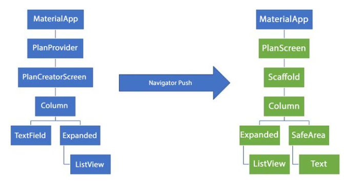

*jawab:*

Diagram tersebut menggambarkan struktur widget tree sekaligus alur navigasi (routing) antar halaman pada aplikasi. Bagian kiri menunjukkan halaman awal yaitu PlanCreatorScreen yang posisinya berada di bawah PlanProvider. Penempatan provider di bagian atas ini penting supaya data daftar rencana bisa dikelola secara global dan dapat diakses oleh semua halaman.

Ketika menekan salah satu item rencana, aplikasi akan menjalankan Navigator.push untuk berpindah ke halaman detail yaitu PlanScreen, seperti yang ditunjukkan di bagian kanan diagram. Dengan struktur seperti ini, halaman detail bisa membangun tampilan sendiri sesuai kebutuhan, misalnya menggunakan ListView untuk menampilkan daftar tugas dan widget Text di dalam SafeArea untuk menunjukkan progres penyelesaian. Meskipun tampilan berbeda, data tetap sinkron dengan halaman utama karena menggunakan arsitektur provider.

### 3. Lakukan capture hasil dari Langkah 14 berupa GIF, kemudian jelaskan apa yang telah Anda buat!

*jawab:*

.gif)

**penjelasan:**

Pada praktikum ini, berhasil menerapkan arsitektur manajemen state yang lebih kompleks untuk mendukung navigasi multi layar (multiple screens). Struktur penyedia data (PlanProvider) dikembangkan sehingga mampu mengelola kumpulan rencana dalam bentuk List<Plan>, tidak lagi terbatas pada satu rencana saja.

Sebagai tampilan utama, dibuat layar baru bernama PlanCreatorScreen yang dilengkapi dengan input teks untuk menambahkan kategori rencana baru, serta komponen ListView untuk menampilkan seluruh daftar rencana lengkap dengan ringkasan progres penyelesaiannya. Selain itu, raouting navigasi antar halaman juga diimplementasikan secara dinamis. Ketika memilih salah satu rencana, aplikasi akan berpindah ke PlanScreen untuk mengelola detail tugas di dalamnya, dengan data yang tetap tersinkronisasi secara real-time di seluruh bagian aplikasi.

### 4. Kumpulkan laporan praktikum Anda berupa link commit atau repository GitHub ke dosen yang telah disepakati !

---