# Laporan Praktikum #11 - Pemrograman Asynchronous

## Identitas Mahasiswa

| Atribut | Nilai                       |
| ------- | -----                       |
| Nama    | Fiza Rahmatus Sholikha      |
| NIM     | 244107060109                |
| Kelas   | SIB-2E                      |

[LINK REPOSITORY KODE PRAKTIKUM](https://github.com/Fizzrss/flutter_plugin_pubdev)

---

## Praktikum 1: Mengunduh Data dari Web Service (API)

### Langkah 1: Buat Project Baru

Buatlah sebuah project flutter baru dengan nama books di folder src week-11 repository GitHub Anda.

Kemudian Tambahkan dependensi http dengan mengetik perintah berikut di terminal.

.png)

.png)

### Langkah 2: Cek file pubspec.yaml

Jika berhasil install plugin, pastikan plugin http telah ada di file pubspec ini seperti berikut.

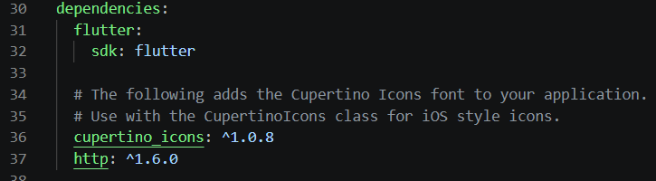

### Langkah 3: Buka file main.dart

Ketiklah kode seperti berikut ini.

> **Soal 1**

> Tambahkan nama panggilan Anda pada title app sebagai identitas hasil pekerjaan Anda.

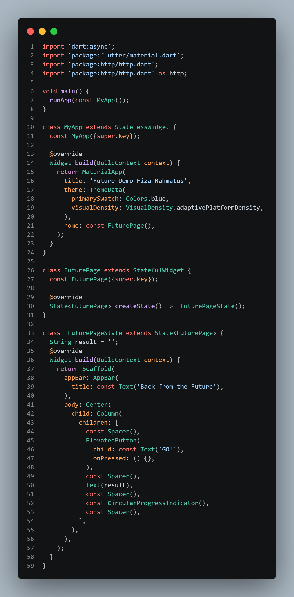

> Catatan:
> Tidak ada yang spesial dengan kode di main.dart tersebut. Perlu diperhatikan di kode tersebut terdapat widget CircularProgressIndicator yang akan menampilkan animasi berputar secara terus-menerus, itu pertanda bagus bahwa aplikasi Anda responsif (tidak freeze/lag). Ketika animasi terlihat berhenti, itu berarti UI menunggu proses lain sampai selesai.

### Langkah 4: Tambah method getData()

Tambahkan method ini ke dalam class _FuturePageState yang berguna untuk mengambil data dari API Google Books.

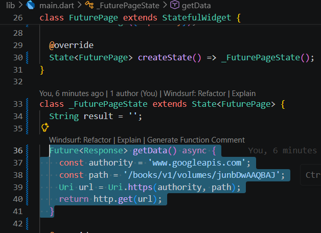

> Soal 2

> - Carilah judul buku favorit Anda di Google Books, lalu ganti ID buku pada variabel path di kode tersebut. Caranya ambil di URL browser Anda seperti gambar berikut ini.

> .png)

> .png)

> - Kemudian cobalah akses di browser URI tersebut dengan lengkap seperti ini. Jika menampilkan data JSON, maka Anda telah berhasil. Lakukan capture milik Anda dan tulis di README pada laporan praktikum. Lalu lakukan commit dengan pesan "W11: Soal 2".

> .png)

### Langkah 5: Tambah kode di ElevatedButton

Tambahkan kode pada onPressed di ElevatedButton seperti berikut.

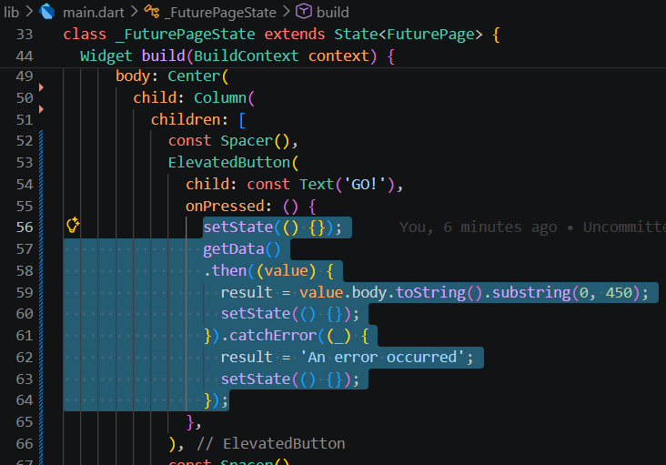

Lakukan run aplikasi Flutter Anda. Anda akan melihat tampilan akhir seperti gambar berikut. Jika masih terdapat error, silakan diperbaiki hingga bisa running.

> Soal 3

> - Jelaskan maksud kode langkah 5 tersebut terkait substring dan catchError!

> *jawab:*

> Penggunaan metode substring(0, 450) pada kode tersebut bertujuan untuk membatasi panjang teks hasil respons dari API Google Books. Hal ini dilakukan karena data yang dikembalikan dalam format JSON biasanya cukup panjang, sehingga hanya diambil 450 karakter pertama agar tampilan antarmuka (UI) tetap rapi, tidak terlalu padat, dan mudah dibaca oleh pengguna. Di sisi lain, catchError digunakan sebagai mekanisme penanganan kesalahan dalam proses asynchronous. Jika terjadi kegagalan saat mengambil data dari server—misalnya akibat koneksi internet yang terputus atau adanya masalah pada endpoint API—maka catchError akan menangkap error tersebut dan memberikan respons berupa pesan "An error occurred". Dengan demikian, aplikasi dapat tetap berjalan dengan stabil tanpa mengalami crash.

> - Capture hasil praktikum Anda berupa GIF dan lampirkan di README. Lalu lakukan commit dengan pesan "W11: Soal 3".

.gif)

---

## Praktikum 2: Menggunakan await/async untuk menghindari callbacks

### Langkah 1: Buka file main.dart

Tambahkan tiga method berisi kode seperti berikut di dalam class _FuturePageState.

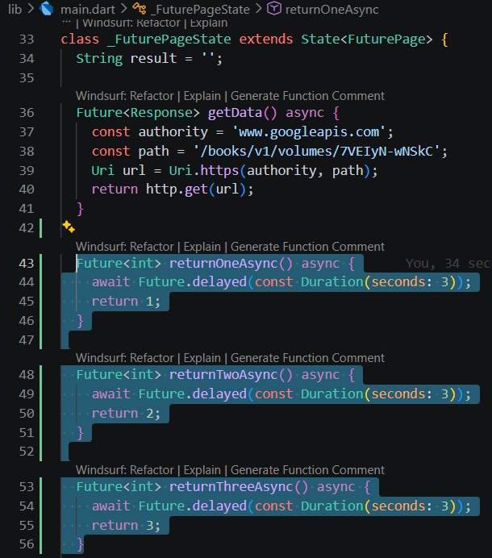

### Langkah 2: Tambah method count()

Lalu tambahkan lagi method ini di bawah ketiga method sebelumnya.

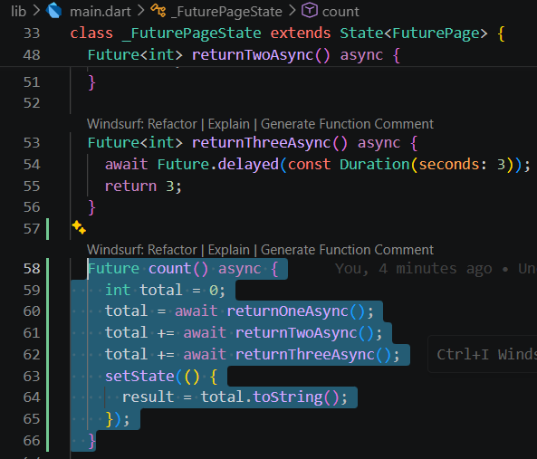

### Langkah 3: Panggil count()

Lakukan comment kode sebelumnya, ubah isi kode onPressed() menjadi seperti berikut.

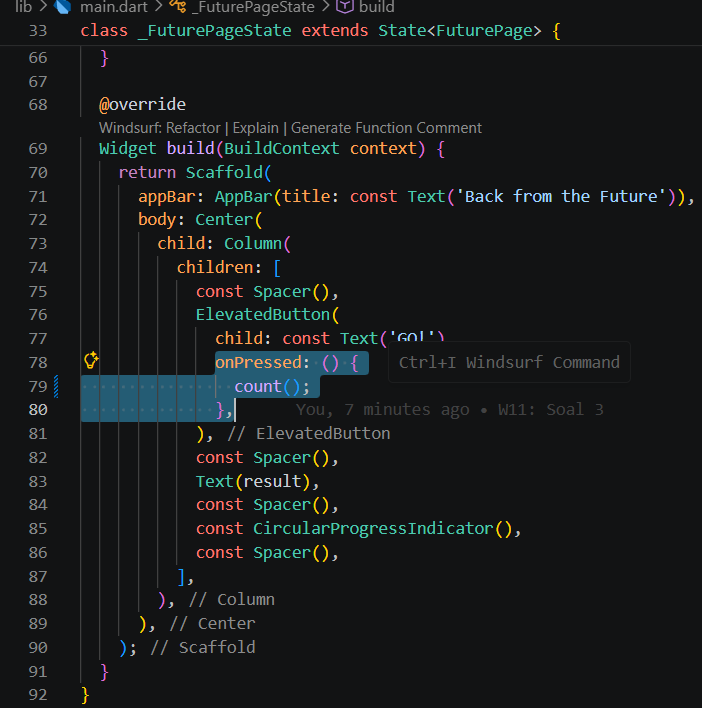

### Langkah 4: Run

Akhirnya, run atau tekan F5 jika aplikasi belum running. Maka Anda akan melihat seperti gambar berikut, hasil angka 6 akan tampil setelah delay 9 detik.

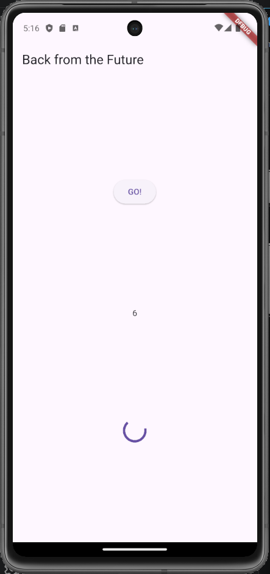

> Soal 4

> - Jelaskan maksud kode langkah 1 dan 2 tersebut!

> *jawab*

> Pada Langkah 1, kode digunakan untuk membuat tiga fungsi asynchronous yang masing-masing mensimulasikan proses penundaan selama 3 detik dengan Future.delayed. Setelah waktu tunggu selesai, setiap fungsi akan mengembalikan nilai integer tertentu, yaitu 1, 2, dan 3. Ketiga fungsi ini menggambarkan proses di dunia nyata yang membutuhkan waktu sebelum menghasilkan output, seperti pengambilan data dari server atau database.
> Sementara itu, pada Langkah 2 (method count), kode berfungsi untuk menjalankan ketiga fungsi tersebut dan menghitung total dari nilai yang dikembalikan. Penggunaan kata kunci await pada setiap pemanggilan fungsi menyebabkan eksekusi dilakukan secara berurutan (sequential). Artinya, program akan menunggu fungsi pertama selesai (3 detik), kemudian melanjutkan ke fungsi kedua, dan seterusnya, sehingga total waktu yang dibutuhkan sekitar 9 detik. Setelah proses perhitungan selesai, method akan memanggil setState untuk memperbarui state aplikasi, sehingga hasil akhirnya dapat langsung ditampilkan pada antarmuka pengguna.

> - Capture hasil praktikum Anda berupa GIF dan lampirkan di README. Lalu lakukan commit dengan pesan "W11: Soal 4".

> .gif)

---

## Praktikum 3: Menggunakan Completer di Future

### Langkah 1: Buka main.dart

Pastikan telah impor package async berikut.

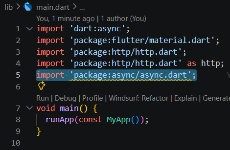

### Langkah 2: Tambahkan variabel dan method

Tambahkan variabel late dan method di class _FuturePageState seperti ini.

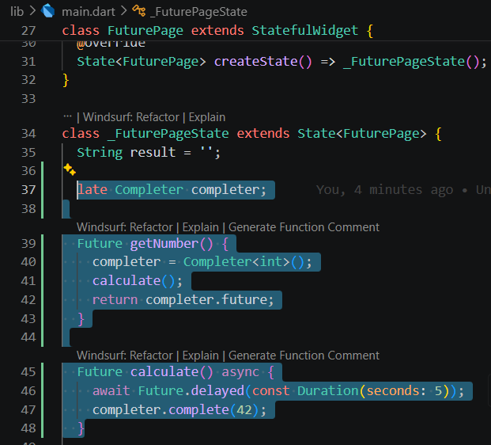

### Langkah 3: Ganti isi kode onPressed()

Tambahkan kode berikut pada fungsi onPressed(). Kode sebelumnya bisa Anda comment.

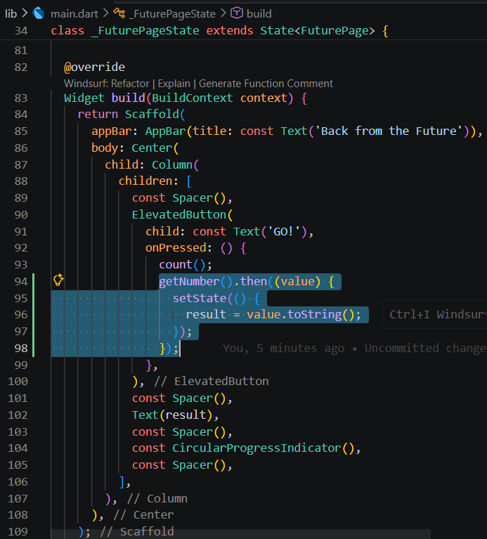

### Langkah 4:

Terakhir, run atau tekan F5 untuk melihat hasilnya jika memang belum running. Bisa juga lakukan hot restart jika aplikasi sudah running. Maka hasilnya akan seperti gambar berikut ini. Setelah 5 detik, maka angka 42 akan tampil.

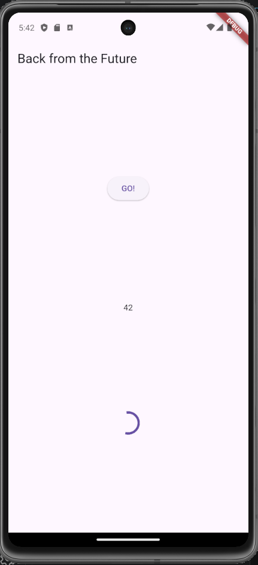

> Soal 5

> - Jelaskan maksud kode langkah 2 tersebut!

> *jawab*

> Kode pada Langkah 2 digunakan untuk menunjukkan bagaimana proses asynchronous dapat dikelola secara manual dengan memanfaatkan kelas Completer. Pada method getNumber(), dibuat sebuah objek Completer yang berfungsi menghasilkan sebuah Future kosong, kemudian langsung dikembalikan ke pemanggil melalui completer.future. Bersamaan dengan itu, method tersebut menjalankan fungsi calculate() di latar belakang, yang mensimulasikan proses komputasi atau pengambilan data dengan jeda waktu sekitar 5 detik. Setelah proses delay selesai, fungsi calculate() akan memanggil completer.complete(42) untuk menyelesaikan Future yang sebelumnya masih tertunda. Perintah ini juga sekaligus mengirimkan nilai akhir berupa angka 42, yang nantinya akan ditampilkan oleh antarmuka aplikasi.

> - Capture hasil praktikum Anda berupa GIF dan lampirkan di README. Lalu lakukan commit dengan pesan "W11: Soal 5".

> .gif)

### Langkah 5: Ganti method calculate()

Gantilah isi code method calculate() seperti kode berikut, atau Anda dapat membuat calculate2()

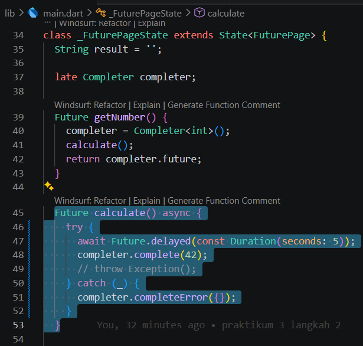

### Langkah 6: Pindah ke onPressed()

Ganti menjadi kode seperti berikut.

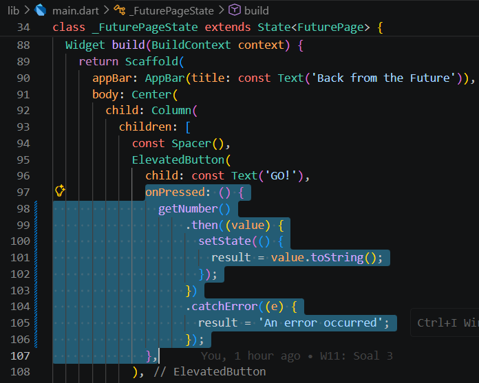

> Soal 6

> - Jelaskan maksud perbedaan kode langkah 2 dengan langkah 5-6 tersebut!

> *jawab:*

> Perbedaan antara kode pada Langkah 2 dan Langkah 5–6 terletak pada error handling. Pada Langkah 2, proses asynchronous dijalankan dengan asumsi selalu berhasil, sehingga tidak disertai mekanisme untuk menangani kemungkinan kegagalan saat pengambilan data. Sebaliknya, pada Langkah 5 dan 6, struktur kode diperbaiki dengan menerapkan pendekatan defensif. Proses komputasi dibungkus dalam blok try-catch untuk menangkap exception dan mengirimkan sinyal kesalahan melalui completeError. Di sisi antarmuka, ditambahkan metode .catchError() untuk menerima dan menangani error tersebut. Dengan adanya peningkatan ini, aplikasi menjadi lebih stabil karena tidak akan crash saat terjadi masalah, melainkan memberikan informasi kepada pengguna melalui pesan "An error occurred".

> - Capture hasil praktikum Anda berupa GIF dan lampirkan di README. Lalu lakukan commit dengan pesan "W11: Soal 6".

> .gif)

---

## Praktikum 4: Memanggil Future secara paralel

### Langkah 1: Buka file main.dart

Tambahkan method ini ke dalam class _FuturePageState

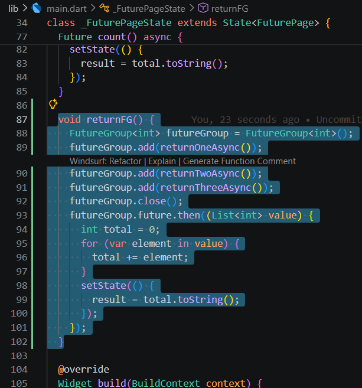

### Langkah 2: Edit onPressed()

Anda bisa hapus atau comment kode sebelumnya, kemudian panggil method dari langkah 1 tersebut.

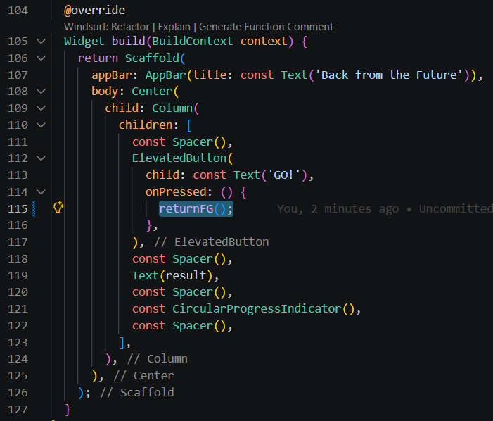

### Langkah 3: Run

Anda akan melihat hasilnya dalam 3 detik berupa angka 6 lebih cepat dibandingkan praktikum sebelumnya menunggu sampai 9 detik.

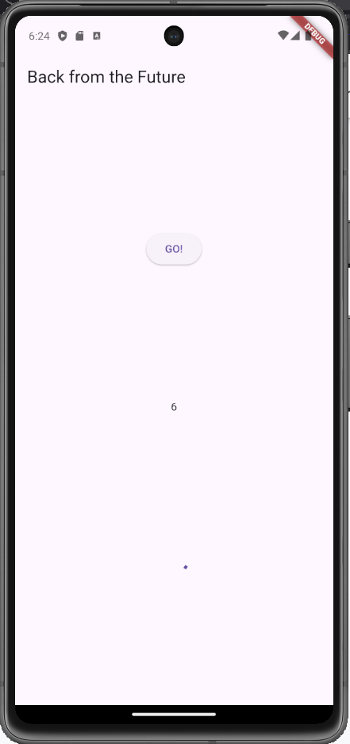

> Soal 7

> - Capture hasil praktikum Anda berupa GIF dan lampirkan di README. Lalu lakukan commit dengan pesan "W11: Soal 7".

> .gif)

### Langkah 4: Ganti variabel futureGroup

Anda dapat menggunakan FutureGroup dengan Future.wait seperti kode berikut.

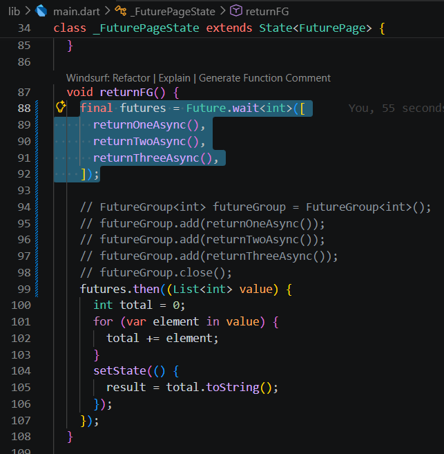

**Hasil run**

.gif)

> Soal 8

> - Jelaskan maksud perbedaan kode langkah 1 dan 4!

> *jawab:*

> Perbedaan antara kode pada Langkah 1 dan Langkah 4 terletak pada tingkat efisiensi dalam mengelola beberapa proses asynchronous secara bersamaan. Pada Langkah 1, penggunaan FutureGroup mengharuskan inisialisasi objek secara manual, kemudian menambahkan setiap fungsi satu per satu dengan metode .add(), serta memanggil .close() sebelum hasil akhirnya bisa diakses melalui properti .future. Sebaliknya, pada Langkah 4 digunakan Future.wait yang lebih sederhana dan bersifat deklaratif, karena cukup menerima sebuah list berisi fungsi-fungsi asynchronous yang akan dijalankan. Walaupun keduanya sama-sama mengeksekusi proses secara paralel—sehingga waktu tunggu berkurang dari sekitar 9 detik menjadi hanya 3 detik—Future.wait lebih sering digunakan dalam pengembangan Flutter karena sintaksnya lebih ringkas dan lebih mudah dalam menangani sekumpulan Future yang jumlahnya sudah diketahui.

---

## Praktikum 5: Menangani Respon Error pada Async Code

### Langkah 1: Buka file main.dart

Tambahkan method ini ke dalam class _FuturePageState

### Langkah 2: ElevatedButton

Ganti dengan kode berikut

### Langkah 3: Run

Lakukan run dan klik tombol GO! maka akan menghasilkan seperti gambar berikut.

Pada bagian debug console akan melihat teks Complete seperti berikut.

> Soal 9

> - Capture hasil praktikum Anda berupa GIF dan lampirkan di README. Lalu lakukan commit dengan pesan "W11: Soal 9".

### Langkah 4: Tambah method handleError()

Tambahkan kode ini di dalam class _FutureStatePage

> Soal 10

> - Panggil method handleError() tersebut di ElevatedButton, lalu run. Apa hasilnya? Jelaskan perbedaan kode langkah 1 dan 4!

---

## Praktikum 6: Menggunakan Future dengan StatefulWidget

### Langkah 1: install plugin geolocator

Tambahkan plugin geolocator dengan mengetik perintah berikut di terminal.

### Langkah 2: Tambah permission GPS

Jika Anda menargetkan untuk platform Android, maka tambahkan baris kode berikut di file 

android/app/src/main/androidmanifest.xml

### Langkah 3: Buat file geolocation.dart

Tambahkan file baru ini di folder lib project Anda.

### Langkah 4: Buat StatefulWidget

Buat class LocationScreen di dalam file geolocation.dart

### Langkah 5: Isi kode geolocation.dart

> Soal 11

> - Tambahkan nama panggilan Anda pada tiap properti title sebagai identitas pekerjaan Anda.

### Langkah 6: Edit main.dart

Panggil screen baru tersebut di file main Anda seperti berikut.

### Langkah 7: Run

Run project Anda di device atau emulator (bukan browser), maka akan tampil seperti berikut ini.

### Langkah 8: Tambahkan animasi loading

Tambahkan widget loading seperti kode berikut. Lalu hot restart, perhatikan perubahannya.

> Soal 12

> - Jika Anda tidak melihat animasi loading tampil, kemungkinan itu berjalan sangat cepat. Tambahkan delay pada method getPosition() dengan kode await Future.delayed(const Duration(seconds: 3));
> - Apakah Anda mendapatkan koordinat GPS ketika run di browser? Mengapa demikian?
> - Capture hasil praktikum Anda berupa GIF dan lampirkan di README. Lalu lakukan commit dengan pesan "W11: Soal 12".

---

## Praktikum 7: Manajemen Future dengan FutureBuilder

### Langkah 1: Modifikasi method getPosition()

Buka file geolocation.dart kemudian ganti isi method dengan kode ini.

### Langkah 2: Tambah variabel

Tambah variabel ini di class _LocationScreenState

### Langkah 3: Tambah initState()

Tambah method ini dan set variabel position

### Langkah 4: Edit method build()

Ketik kode berikut dan sesuaikan. Kode lama bisa Anda comment atau hapus.

> Soal 13

> - Apakah ada perbedaan UI dengan praktikum sebelumnya? Mengapa demikian?
> - Capture hasil praktikum Anda berupa GIF dan lampirkan di README. Lalu lakukan commit dengan pesan "W11: Soal 13".
> - Seperti yang Anda lihat, menggunakan FutureBuilder lebih efisien, clean, dan reactive dengan Future bersama UI.

### Langkah 5: Tambah handling error

Tambahkan kode berikut untuk menangani ketika terjadi error. Kemudian hot restart.

> Soal 14

> - Apakah ada perbedaan UI dengan langkah sebelumnya? Mengapa demikian?
> - Capture hasil praktikum Anda berupa GIF dan lampirkan di README. Lalu lakukan commit dengan pesan "W11: Soal 14".

---

## Praktikum 8: Navigation route dengan Future Function

### Langkah 1: Buat file baru navigation_first.dart

Buatlah file baru ini di project lib Anda.

### Langkah 2: Isi kode navigation_first.dart

> Soal 15

> - Tambahkan nama panggilan Anda pada tiap properti title sebagai identitas pekerjaan Anda.
> - Silakan ganti dengan warna tema favorit Anda.

### Langkah 3: Tambah method di class _NavigationFirstState

Tambahkan method ini.

### Langkah 4: Buat file baru navigation_second.dart

Buat file baru ini di project lib Anda. Silakan jika ingin mengelompokkan view menjadi satu folder dan sesuaikan impor yang dibutuhkan.

### Langkah 5: Buat class NavigationSecond dengan StatefulWidget

### Langkah 6: Edit main.dart

Lakukan edit properti home.

### Langkah 8: Run

Lakukan run, jika terjadi error silakan diperbaiki.

> Soal 16

> - Cobalah klik setiap button, apa yang terjadi ? Mengapa demikian ?
> - Gantilah 3 warna pada langkah 5 dengan warna favorit Anda!
> - Capture hasil praktikum Anda berupa GIF dan lampirkan di README. Lalu lakukan commit dengan pesan "W11: Soal 16".

Hasilnya akan seperti gambar berikut ini.

---

## Praktikum 9: Memanfaatkan async/await dengan Widget Dialog

### Langkah 1: Buat file baru navigation_dialog.dart

Buat file dart baru di folder lib project Anda.

### Langkah 2: Isi kode navigation_dialog.dart

### Langkah 3: Tambah method async

### Langkah 4: Panggil method di ElevatedButton

### Langkah 5: Edit main.dart

Ubah properti home

### Langkah 6: Run

Coba ganti warna background dengan widget dialog tersebut. Jika terjadi error, silakan diperbaiki. Jika berhasil, akan tampil seperti gambar berikut.

> Soal 17

> - Cobalah klik setiap button, apa yang terjadi ? Mengapa demikian ?
> - Gantilah 3 warna pada langkah 3 dengan warna favorit Anda!
> - Capture hasil praktikum Anda berupa GIF dan lampirkan di README. Lalu lakukan commit dengan pesan "W11: Soal 17".
