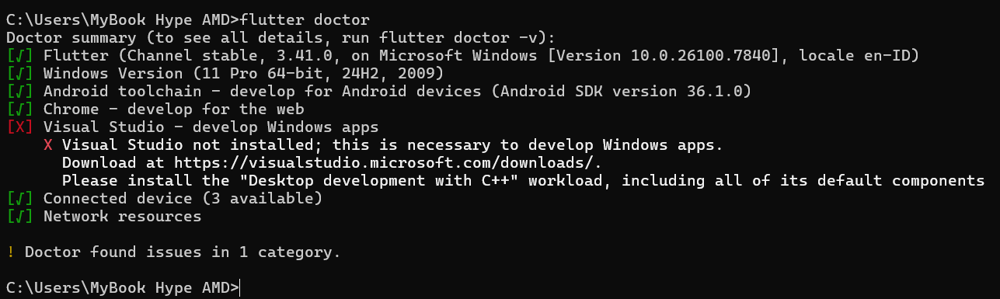

# Laporan Praktikum #01 - Pengantar Pemrograman Mobile

## Identitas Mahasiswa

| Atribut | Nilai                        |
| ------- | -----                        |
| Nama    | Fiza Rahmatus Sholikha      |
| NIM     | 244107060109                |
| Kelas   | SIB-2E                       |

---

## Tugas Praktikum 1

### Hasil Flutter Doctor

Berikut adalah hasil dari perintah `flutter doctor -v` yang menunjukkan bahwa semua komponen telah terinstal dan terkonfigurasi dengan baik:

> **Catatan:** Semua komponen telah terpasang dengan baik dan tidak ada issue yang ditemukan (`No issues found!`).