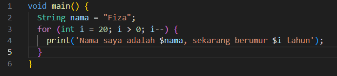
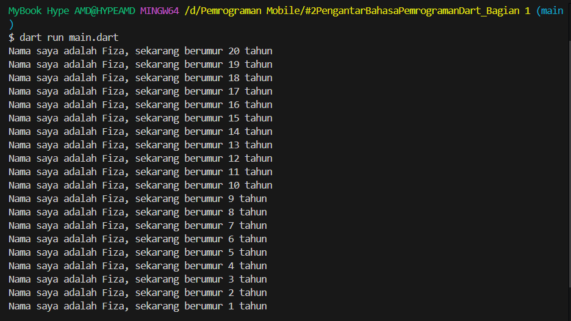
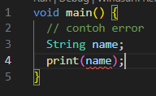
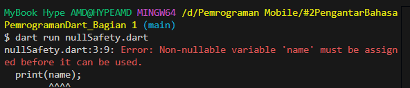
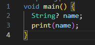
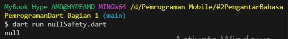
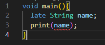
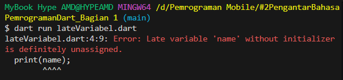
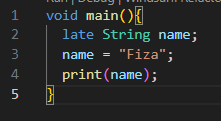

# Laporan Praktikum #2 Pengantar Bahasa Pemrograman Dart Bagian 1

## Identitas Mahasiswa

| Atribut | Nilai                       |
| ------- | -----                       |
| Nama    | Fiza Rahmatus Sholikha      |
| NIM     | 244107060109                |
| Kelas   | SIB-2E                      |

---

## Tugas Praktikum 2

### Soal 1

Modifikasilah kode pada baris 3 di VS Code atau Editor Code favorit Anda berikut ini agar mendapatkan keluaran (output) sesuai yang diminta!

*jawab:*

*Output:*

---

### Soal 2

Mengapa sangat penting untuk memahami bahasa pemrograman Dart sebelum kita menggunakan framework Flutter ? Jelaskan!

*jawab:*

Sangat penting, karena bahasa Dart merupakan inti dari framework flutter yang dimana semua kode, fitur dan struktur programnya ditulis dengan Dart. Sehingga dengan memahami bahasanya akan memudahkan untuk memahami logika program.

---

### Soal 3

Rangkumlah materi dari codelab ini menjadi poin-poin penting yang dapat Anda gunakan untuk membantu proses pengembangan aplikasi mobile menggunakan framework Flutter.

*jawab:*
1. Dart adalah bahasa inti Flutter sehingga penting untuk memahami dasar-dasar bahasa Dart sebelum membuat aplikasi flutter. Selain itu bahasa ini mendukung lintas platform memudahkan untuk membuat aplikasi yang bisa berjalan di banyak perangkat tanpa harus memakai bahasa berbeda
2. Dart menggunakan konsep OOP yang memudahkan penyusunan program yang rapi dan modular
3. Semua tipe data adalah objek sehingga lebih konsisten dan fleksibel karena semua memiliki method
4. Terdapat JIT yang berguna saat development karena mendukung debugging dan hot reload dan AOT berguna saat rilis karena meningkatkan performa aplikasi
5. Terdapat operator seperti aritmatika, logika, relasional, dan increment/decrement untuk mengolah data dan logika program
6. Null Safety yang digunakan untuk mencegah error saat variabel kosong
7. Late variable digunakan saat sebuah variabel diinisialisasi nanti saat nilai baru tersedia setelah proses tertentu

---

### Soal 4

Buatlah penjelasan dan contoh eksekusi kode tentang perbedaan Null Safety dan Late variabel !

*jawab:*

### **Null Safety**
Null Safety adalah fitur yang digunakan untuk menghindari kesalahan runtime yang disebabkan oleh null sehingga mengurangi terjadinya NullPointerException, karena variabel pada dart tidak bisa diinisialisasi dengan null. Null Safety ini akan memastikan setiap variabel sudah memiliki nilai sebelum digunakan. Namun jika ingin sebuah variabel bernilai null, harus secara eksplisit menandainya sebagai nullable dengan menggunakan tanda tanya (?)

#### Contoh Program Error

#### Output:

#### penjelasan
kode tersebut error karena variabel tersebut bertipe string namun belum diinstansiasi yang seharusnya jika variabel tersebut belum diinstansiasi harus ada tanda ? sebelum dipakai. Oleh karena itu, Dart menampilkan error untuk mencegah program berjalan dengan data kosong

#### Contoh Program Berjalan

#### Output:

#### penjelasan
kode tersebut tidak error karena variabel name yang tidak diinstansiasi dideklarasikan dengan tanda ? yang dimana Dart akan menganggap variabel tersebut boleh bernilai null

### **Late Variabel**
Late variabel adalah fitur yang digunakan ketika variabel tidak langsung diberi nilai saat dideklarasikan namun nilainya akan diisi sebelum digunakan. 
Dengan memberikan kata kunci late akan memberitahu compiler agar tidak menampilkan error saat deklarasi. Biasanya digunakan saat variabel baru diketahui setelah proses tertentu

#### Contoh Program dipakai sebelum diisi

#### Output:

#### penjelasan
karena nama belum diberi nilai saat diprint maka Dart akan menampilkan error saat program dijalankan.

#### Contoh Program diisi sebelum dipakai

#### Output:

#### penjelasan
pada program ini variabel nama dideklarasikan tanpa nilai, tetapi program dapat berjalan karena menggunakan late. Kemudian sebelum digunakan variabel diisi sebelum digunakan, program dapat berjalan tanpa error. 

---