# Laporan Praktikum #03 - Pengantar Bahasa Pemrograman Dart - Bagian 2

## Identitas Mahasiswa

| Atribut | Nilai                       |
| ------- | -----                       |
| Nama    | Fiza Rahmatus Sholikha      |
| NIM     | 244107060109                |
| Kelas   | SIB-2E                      |


---

## Praktikum 1: Menerapkan Control Flows ("if/else")

### Langkah 1

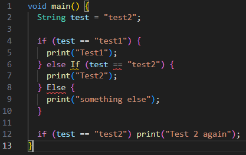

### Langkah 2

**Screenshot hasil run error**

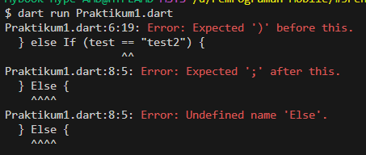

**Screenshot kode program perbaikan**

``` dart
void main() {
  String test = "test2";

  if (test == "test1") {
    print("Test1");
  } else if (test == "test2") {
    print("Test2");
  } else {
    print("something else");
  }

  if (test == "test2") print("Test 2 again");
}

```

**Screenshot Hasil run perbaikan**

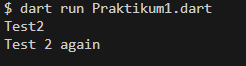

**Penjelasan:**

Program tersebut menampilkan 2 output yaitu "Test2" dan "Test 2 again".
Pada program pertama kondisi if-else membandingkan nilai test dengan "test1" dan "test2" namun karena nilai test adalah "test2" maka kondisi kedua benar karena kondisinya adalah (test == "test") sehingga menampilkan output "Test2".
Pada program kedua terdapat kondisi (test == "test2") yang dimana kondisi tersebut juga terpenuhi sehingga menghasilkan output "Test 2 again".

## Langkah 3

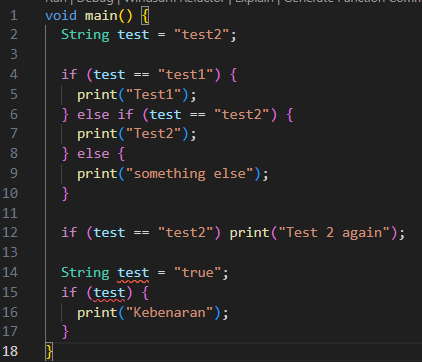

**Screenshot Hasil run**

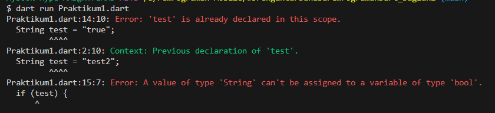

**Perbaikan kode**

``` dart
void main() {
  String test = "test2";

  if (test == "test1") {
    print("Test1");
  } else if (test == "test2") {
    print("Test2");
  } else {
    print("something else");
  }

  if (test == "test2") print("Test 2 again");

  String test2 = "true";
  if (test2 == "true") {
    print("Kebenaran");
  } else {
    print("Kesalahan");
  }
}

```

**Screenshot Hasil run perbaikan**

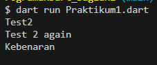

**Penjelasan**

Awalnya program tersebut error karena terdapat deklarasi variabel yang sama pada langkah 1 dan kondisi if seharusnya berupa nilai boolean, sedangkan variabel test bertipe string dengan isi "true" yang dimana tipe datanya tidak sesuai sehingga tidak bisa dianggap nilai boolean.

Program diperbaiki dengan mengunbah kondisi menjadi test == "true" sehingga dapat berjalan dan menghasilkan nilai boolean. Jika kondisi terpenuhi maka menghasilkan output "Kebenaran"

---

## Praktikum 2: Menerapkan Perulangan "while" dan "do-while"

### Langkah 1

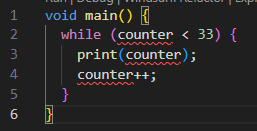

### Langkah 2

**Screenshot Hasil run error**

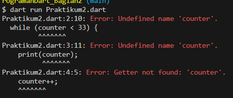

**Perbaikan kode**

``` dart
void main() {
  int counter = 10;
  while (counter < 33) {
    print(counter);
    counter++;
  }
}

```

**Screenshot Hasil run perbaikan**

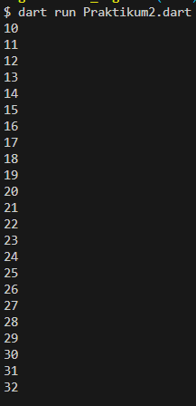

**Penjelasan**

Program tersebut awalnya error karena variabel counter belum dideklarasikan dan diinisialisasikan sehingga perlu ditambah kode int counter = 10 sebagai deklarasi counter dengan nilai 10 yang dimana nilai 10 ini merupakan nilai awal perulangan. Setelah diperbaiki, program melakukan perulangan yang dimana jika kondisi (counter < 33) terpenuhi akan mencetak nilai variabel counter kemudian nilai tersebut akan di increment (ditambah) sebesar 1 sehingga outputnya adalah nilai dari angka 10 hingga 32 karena kondisi (counter < 33) akan berhenti atau bernilai false jika variable bernilai 33.

### Langkah 3

``` dart
void main() {
  int counter = 10;
  while (counter < 33) {
    print(counter);
    counter++;
  }

  do {
    print(counter);
    counter++;
  } while (counter < 77);
}

```

**Screenshot Hasil run**

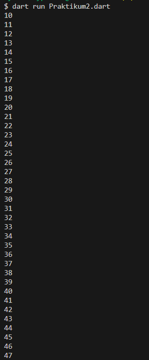 
.png)

**Penjelaan**
Program tidak error karena variabel counter sudah dideklarasikan dan diinisialisasi sehingga perulangan do-while akan melanjutkan perulangan yang sudah dilakukan oleh perulangan while. Setelah perulangan while nilai counter menjadi 33 sehinggan do-while akan mencetak nilai dari angka 33 hingga 76 karena perulangan do-while akan mengecek mengeksekusi dulu minimal satu kali sebelum kondisi diperiksa

---

## Praktikum 3: Menerapkan Perulangan "for" dan "break-continue"

### Langkah 1

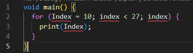

### Langkah 2

**Screenshot Hasil run error**

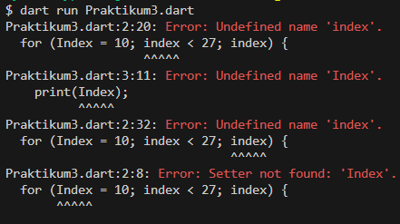

**Perbaikan kode**

``` dart
void main() {
  for (int index = 10; index < 27; index++) {
    print(index);
  }
}
```

**Screenshot Hasil run perbaikan**

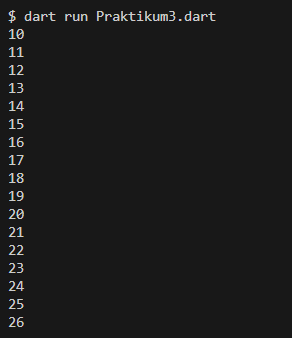

**Penjelasan**
Program awalnya mengalami error kompilas karena terdapat penulisan variabel yang tidak sinkron seperti huruf kapital (Index) dan huruf kecil (index). Selain itu variabel index belum dideklarasi dengan tipe data int sehingga perlu ditambah (int index = 10). Pada bagian kondisi for awalnya tidak dideklasrasikan dengan index++ yang menyebahkan infinite loop jika tidak diperbaiki. Setelah diperbaiki, program melakukan perulangan yang dimana jika kondisi (index < 27) terpenuhi akan mencetak nilai variabel index kemudian nilai tersebut akan di increment (ditambah) sebesar 1 sehingga outputnya adalah nilai dari angka 10 hingga 26 karena kondisi (index < 27) akan berhenti atau bernilai false jika variable bernilai 27.

### Langkah 3

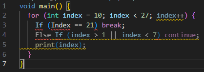

**Screenshot Hasil run error**

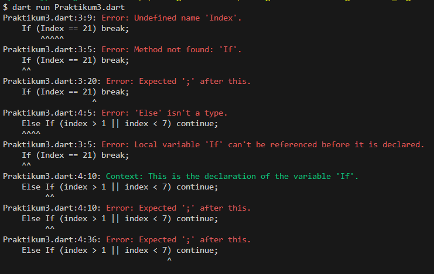

**Perbaikan Kode**

``` dart
void main() {
  for (int index = 10; index < 27; index++) {
    if (index == 21) break;
    else if (index > 1 || index < 7) continue;
    print(index);
  }
}

```

**Screenshot Hasil run perbaikan**

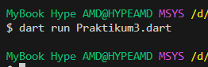

**Penjelasan**
Program tersebut awalnya error karena penulisan If dan Else If dengan huruf salah seharusnya ditulis dengan if dan else if huruf kecil serta penulisan Index tidak konsisten harusnya ditulis dengan huruf kecil (index).

Program berjalan dengan nilai awal 10, kemudian dicek kondisi index < 27. Jika true program terlebih dahulu memeriksa apakah (index == 21) jika true, perulangan langsung dihentikan karena ada perintah break. Jika false, program mengecek kondisi (index > 1 || index < 7) jika kondisi ini benar, maka continue dijalankan sehingga proses pencetakan dilewati dan langsung lanjut ke iterasi berikutnya. 
Program tidak menghasilkan output apa pun karena setiap nilai index dari 10 sampai sebelum 21 selalu memenuhi kondisi (index > 1 || index < 7) sehingga perintah continue terus dijalankan dan saat index mencapai 21 perulangan langsung berhenti oleh break sebelum mencetak nilai.

---

## Tugas
### Buatlah sebuah program yang dapat menampilkan bilangan prima dari angka 0 sampai 201 menggunakan Dart. Ketika bilangan prima ditemukan, maka tampilkan nama lengkap dan NIM Anda.

**Kode Program**
~~~ dart
void main() {
  String nama = "Fiza Rahmatus Sholikha";
  String nim = "244107060109";
  
  for (int i = 0; i <= 201; i++) {
    bool isPrima = true;
    if (i < 2) {
      isPrima = false;
    } else {
      for (int j = 2; j <= i ~/ 2; j++) {
        if (i % j == 0) {
          isPrima = false;
          break;
        }
      }
    }
    if (isPrima) {
      print("$i. $nama | $nim");
    } else {
      print("$i");
    }
  }
}
~~~

**Output**

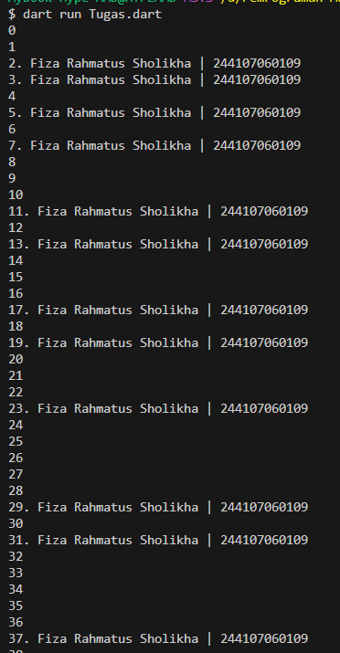

.png)
