# Laporan Praktikum #03 - Pengantar Bahasa Pemrograman Dart - Bagian 3

## Identitas Mahasiswa

| Atribut | Nilai                       |
| ------- | -----                       |
| Nama    | Fiza Rahmatus Sholikha      |
| NIM     | 244107060109                |
| Kelas   | SIB-2E                      |


---

## Praktikum 1: Eksperimen Tipe Data List

### Langkah 1

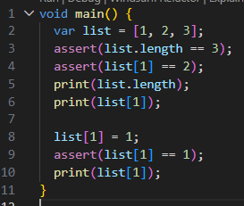

### Langkah 2

**Screenshot hasil run error**

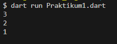

**Penjelasan**

Program pertama membuat sebuah list dengan isi 1,2,3 kemudian terdapat fungsi assert yang dimana digunakan untuk mengecek apakah kondisi bernilai benar, jika benar maka program akan terus berjalan, jika salah maka program akan berhenti dan menampilkan error saat debugging.

Pada program tersebu tedapat assert(list.length == 3) yang mengecek apakah panjang list adalah 3 kemudian assert(list[1] == 2) untuk memastikan elemen indeks ke-1 adalah 2. Kedua program tersebut bernilai true sehingga program tetap berjalan dan mencetak nilai panjang list yaitu 3 dan elemen indeks ke-1 yaitu 2. Setelah itu list[1] = 1 mengubah indeks ke-1 menjadi 1 dan assert(list[1] == 1) mengecek apakah benar nilai indeks ke-1 adalah 1 dan hasilnya adalah true sehingga program tetap berjalan serta mencetak nilai baru tersebut. Oleh karena itu, program tersebut mencetak outpur 3, 2, 1 

## Langkah 3

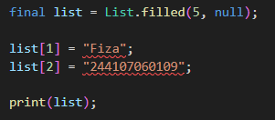

**Screenshot Hasil run**

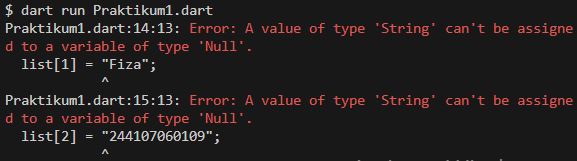

**Perbaikan kode**

``` dart
void main() {
  final List<dynamic> list = List.filled(5, null);

  list[1] = "Fiza";
  list[2] = "244107060109"; 

  print(list);
}

```

**Screenshot Hasil run perbaikan**

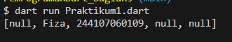

**Penjelasan**

Awalnya program tersebut mengubah variabel menjadi final dan List.filled(5, null) untuk membuat list berisi 5 dengan nilai awal null. Meskipun variabel yang dibuat final masih bisa mengubah elemennya, porgram ini tetap error karena program ingin mengisi list[1] dan list[2] dengan String nama dan nim sedangkan list dianggap bertipe `List<int>`. 

Untuk memperbaiki error tersebut, tipe data list dibuat `List<dynamic>` agar dapat menyimpan berbagai tipe data, seperti String untuk nama dan nim. Setelah itu, program akan mencetak seluruh isi list yang berisi null pada indeks lain, serta menampilkan nama dan nim pada indeks yang telah diisi.

---

## Praktikum 2: Eksperimen Tipe Data Set

### Langkah 1

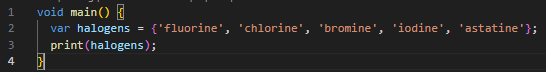

### Langkah 2

**Screenshot Hasil run**

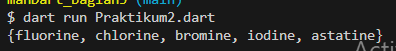

**Penjelasan**

Program tidak error dan menampilkan output isi dari variabel halogens karena variabel tersebut merupakan Set yang dimana adalah sekumpulan data yang tidak memiliki index dan tidak boleh duplikasi. Hal ini ditandai dengan menggunakan tanda {} dengan beberapa nilai sehingga Dart otomatis akan mengenali sebagai data Set

### Langkah 3

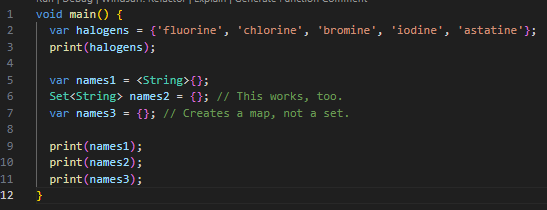

**Screenshot Hasil run**

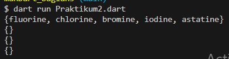

**Perbaikan kode**

``` dart
void main() {
  var halogens = {'fluorine', 'chlorine', 'bromine', 'iodine', 'astatine'};
  print(halogens);

  var names1 = <String>{};
  Set<String> names2 = {}; // This works, too.

  names1.add("Fiza");
  names1.add("244107060109");
  
  names2.addAll({"Fiza", "244107060109"});

  print(names1);
  print(names2);
}

```

**Screenshot Hasil run perbaikan**

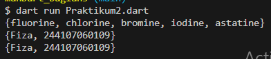

**Penjelasan**

Awalnya program ketika dijalankan tidak terjadi error tetapi hanya mencetak tanda {} kosong sebanyak 3 baris karena dua data Set (names1 dan names2) kosong dan satu Map (names3) juga kosong.

Kemudian kode diperbaiki dengan menambahkan nama dan nim pada variabel Set dengan fungsi yang berbeda
- fungsi add() untuk menambahkan elemen satu per satu
- fungsi addAll() untuk menambah beberapa elemen sekaligus dalam bentuk Set

Sementara names3 dihapus karena merupakan variabel Map yang dimana tanda {} tanpa tipe diinterpretasikan sebagai Map kosong

---

## Praktikum 3: Eksperimen Tipe Data Maps

### Langkah 1

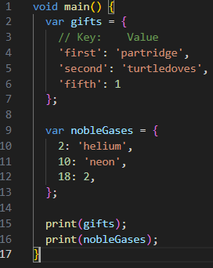

### Langkah 2

**Screenshot Hasil run**

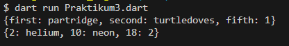


**Penjelasan**

Program tersebut tidak terjadi error karena Map di Dart memperbolehkan value dengan tipe berbeda jika diifer sebagai obect. Dart melakukan type inference yang dimana gift dianggap sebagai `Map<String, Object>` karena key berupa String dan value berisi String serta int. Sedangkan nobleGases dianggap sebagai `Map<int, Object>` karena key berupa int dan value berisi String serta int. 

### Langkah 3

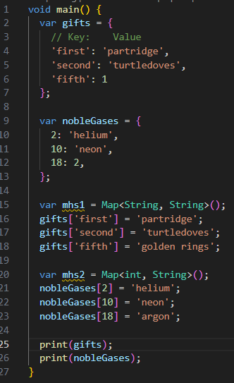

**Screenshot Hasil run**

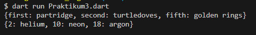

**Penjelasan**

Program tidak error, hanya terjadi perubahan nilai pada Map. Program membuat dua Map baru (mhs1 dan mhs2) yang kosong secara eksplisit dan menimpa nilai yang sudah ada pada pada gifts['fifth'] yang awalnya bernilai 1 diganti menjadi 'golden rings' dan pada nobleGases[18] yang awalnya 2 diganti menjadi 'argon'

**Penambahan Kode**

``` dart
void main() {
  var gifts = {
    // Key:    Value
    'first': 'partridge',
    'second': 'turtledoves',
    'fifth': 1
  };

  var nobleGases = {
    2: 'helium',
    10: 'neon',
    18: 2,
  };

  var mhs1 = Map<String, String>();
  gifts['first'] = 'partridge';
  gifts['second'] = 'turtledoves';
  gifts['fifth'] = 'golden rings';

  var mhs2 = Map<int, String>();
  nobleGases[2] = 'helium';
  nobleGases[10] = 'neon';
  nobleGases[18] = 'argon';

  // Penambahan kode
  gifts['nama'] = 'Fiza';
  gifts['nim'] = '244107060109';

  nobleGases[20] = 'Fiza';
  nobleGases[21] = '244107060109';

  mhs1['nama'] = 'Fiza';
  mhs1['nim'] = '244107060109';

  mhs2[1] = 'Fiza';
  mhs2[2] = '244107060109';

  print("Gifts: $gifts");
  print("Noble Gases: $nobleGases");
  print("Mhs1: $mhs1");
  print("Mhs2: $mhs2");
}

```

**Screenshot Hasil run penambahan**

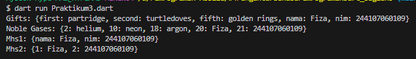

---

## Praktikum 4: Eksperimen Tipe Data List: Spread dan Control-flow Operators

### Langkah 1

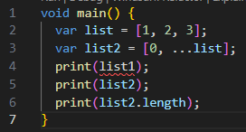

### Langkah 2

**Screenshot Hasil run error**

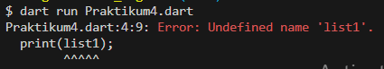

**Perbaikan kode**

``` dart
void main() {
  var list = [1, 2, 3];
  var list2 = [0, ...list];
  print(list);
  print(list2);
  print(list2.length);
}

```

**Screenshot Hasil run perbaikan**

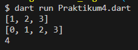

**Penjelasan**

Program tersebut error karena pada perintah print(list1) variabel list1 tidak pernah dideklarasikan. Hanya ada variabel list dan list2 yang dideklarasikan. Oleh karena itu, perintah print(list1) diganti dengan print(list) agar kode berjalan

Setelah diperbaiki, variabel list berisi [1,2,3]. Kemudian list2 dibuat dengan menambahkan angka 0 di awal dan menggunakan spread operator (...) untuk memasukkan seluruh isi list. Oleh karena itu, list2 menjadi [0,1,2,3] dengan panjang list (length) 4 elemen

### Langkah 3

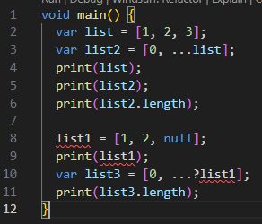

**Screenshot Hasil run error**

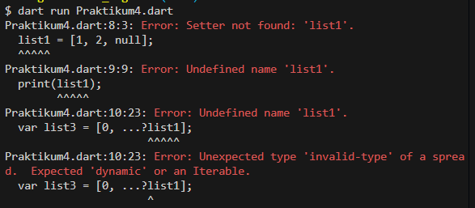

**Perbaikan kode**

``` dart
void main() {
  var list = [1, 2, 3];
  var list2 = [0, ...list];
  print(list);
  print(list2);
  print(list2.length);

  var list1 = [1, 2, null];
  print(list1);
  var list3 = [0, ...?list1];
  print(list3);
  print(list3.length);
}

```

**Screenshot Hasil run perbaikan**

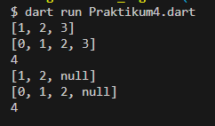

**Penjelasan**

Awalnya program error karena variabel list belum dideklarasika tetapi langsung diberi nilai, harus dideklarsikan dengan var, list, atau tipe lainnya karena jika tidak maka muncul error “Undefined name 'list1'” dan “Setter not found: 'list1'”

Setelah diperbaiki, operator ...? (null-aware spread operator) digunakan untuk menambahkan isi list1 ke list3. Jika list1 bernilai null, maka tidak dimasukkan ke dalam list, namun jika ada isinya maka semua ditambahkan. Sehingga list3 menjadi [0,1,2,null] dengan panjang 4 elemen

**Penambahan Kode variabel list berisi NIM menggunakan Spread Operators**

``` dart
void main() {
  var list = [1, 2, 3];
  var list2 = [0, ...list];
  print(list);
  print(list2);
  print(list2.length);

  var list1 = [1, 2, null];
  print(list1);
  var list3 = [0, ...?list1];
  print(list3);
  print(list3.length);

  // Penambahan kode
  var nim = ['244107060109'];
  var list4 = [0, ...nim];
  print(list4);
}

```

**Screenshot Hasil run penambahan**

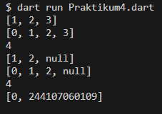

---

### Langkah 4

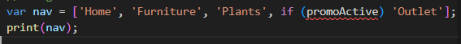

**Screenshot Hasil run error**

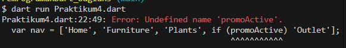

**Perbaikan kode promoActive = true**

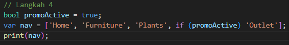

**Screenshot Hasil run perbaikan promoActive = true**

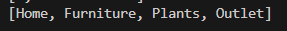

**Perbaikan kode promoActive = false**

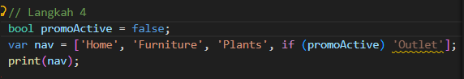

**Screenshot Hasil run perbaikan promoActive = false**

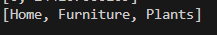

**Penjelasan**

Program ini awalnya error karena variabel promoActive belum dideklarasikan, namun sudah langsung digunakan dalam list sehingga muncul error Undefined name 'promoActive'

kode diperbaiki dengan mendeklarasikan variabel promoActive dengan tipe bool. Kemudian kode ini menggunakan collection if pada dart yaitu if (promoActive) 'Outlet' untuk elemen 'Outlet' hanya akan dimasukkan ke dalam list jika promoActive bernilai true. Oleh karena itu, ketika promoActive = true maka output yang keluat adalah [Home, Furniture, Plants, Outlet] dan jika promoActive = false output yang keluar adalah [Home, Furniture, Plants] karena kondisi false maka if (promoActive) 'Outlet' tidak dijalankan. Collection if pada dart memungkinkan menambahkan elemen ke dalam list secara kondisional langsung dalam deklarasi list.    

### Langkah 5

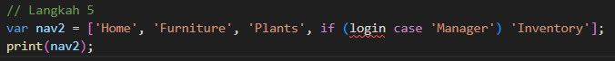

**Screenshot Hasil run error**

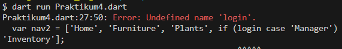

**Perbaikan kode login = 'Manager'**
``` dart
void main() {
  // Langkah 5
  String login = 'Manager';
  var nav2 = ['Home', 'Furniture', 'Plants', if (login case 'Manager') 'Inventory'];
  print(nav2);
}

```

**Screenshot Hasil run perbaikan login = 'Manager'**
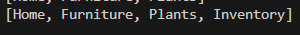

**Perbaikan kode login kondisi lain**
``` dart
void main() {
  // Langkah 5
  String login = 'User';
  var nav2 = ['Home', 'Furniture', 'Plants', if (login case 'Manager') 'Inventory'];
  print(nav2);
}

```

**Screenshot Hasil run perbaikan login kondisi lain**
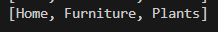

**Penjelasan**

Program awalnya error karena variabel login belum dideklarasikan, namun sudah langsung digunakan dalam list sehingga muncul error Undefined name 'login'.

Kode diperbaiki dengan mendeklarasikan login dengan tipe String. Kemudian kode ini menggunakan collection if dengan pattern matching yaitu if (login case 'Manager'). Jika nilai login cocok dengan 'Manager', maka elemen 'Inventory' akan dimasukkan ke dalam list nav2. Jika tidak cocok, maka elemen tersebut tidak akan ditambahkan sehingga list hanya berisi tiga elemen.

### Langkah 6

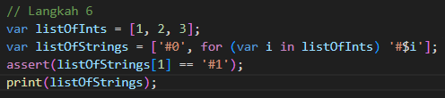

**Screenshot Hasil run**

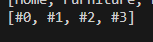

**Penjelasan**

Program tidak error dan menghasilkan output [#0, #1, #2, #3]. Program membuat listOfInts dengan isi angka [1,2,3], kemudian menggunakan Collection For pada listOfStrings untuk menambahkan elemen baru berdasarkan setiap isi listOfInts. Setiap angka diubah menjadi string dengan format '#i', sehingga terbentuk '#1', '#2', dan '#3'. Setelah itu, assert(listOfStrings[1] == '#1') untuk memastikan bahwa elemen index ke-1 benar bernilai '#1'. Jika kondisi tidak terpenuhi, program akan menghasilkan error saat debug.

Manfaat Collection For digunakan untuk membuat atau menambahkan elemen ke dalam koleksi seperti List, Set, atau Map secara otomatis menggunakan perulangan untuk mempermudah pembuatan atau transformasi data ke dalam koleksi secara lebih singkat dan jelas tanpa perlu membuat perulangan terpisah.

---

## Praktikum 5: Eksperimen Tipe Data Records

### Langkah 1

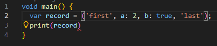

### Langkah 2

**Screenshot Hasil run error**

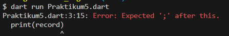

**Perbaikan kode**

``` dart
void main() {
  var record = ('first', a: 2, b: true, 'last');
  print(record);
}

```

**Screenshot Hasil run perbaikan**

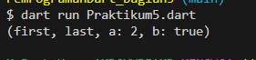

**Penjelasan**
Awalnya program error karena perintah print(record) kurang tanda ; untuk menutup perintah. Ketika sudah diperbaiki program menampilkan output (first, last, a: 2, b: true) karena menggunakan struktur data Record yaitu struktur data yang menyimpan beberapa nilai dengan tipe yang berbeda dalam satu variabel. Saat dicetak secara otomatis Dart mengurutkan dan menampilkan positional field yaitu nilai tanpa label ('first' dan 'last') terlebih dahulu, baru kemudian diikuti oleh named field yaitu nilai yang memiliki label khusus (a: 2 dan b: true)


### Langkah 3

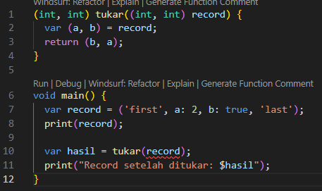

**Screenshot Hasil run error**

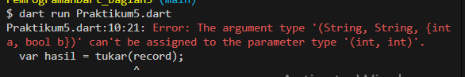

**Perbaikan kode**

``` dart
(int, int) tukar((int, int) record) {
  var (a, b) = record;
  return (b, a);
} 

void main() {
  // Langkah 1
  var record = ('first', a: 2, b: true, 'last');
  print(record);

  // Langkah 3
  var record2 = (5, 50);
  print("Record sebelum ditukar: $record2");
  var hasil = tukar(record2);
  print("Record setelah ditukar: $hasil");
}

```

**Screenshot Hasil run perbaikan**

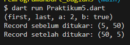

**Penjelasan**

Awalnya program error karena fungsi tukar() dipanggil dengan variabel record = ('first', a: 2, b: true, 'last') padahal fungsi tukar() mengharapkan parameter bertipe record (int, int), sedangkan record berisi String, int, dan bool sehingga tidak bisa diproses oleh fungsi tukar()

Setelah diperbaiki, fungsi tukar() menerima parameter berupa record dengan dua nilai integer (int, int) dan menggunakan record destructuring yaitu var (a, b) = record untuk memisahkan nilai record menjadi a dan b, kemudian mengembalikan record baru dengan urutan yang dibalik (b, a) sehingga posisi nilainya tertukar.

### Langkah 4

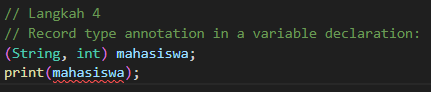

**Screenshot Hasil run error**

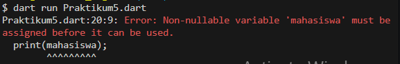

**Perbaikan kode**

``` dart
(int, int) tukar((int, int) record) {
  var (a, b) = record;
  return (b, a);
} 

void main() {
  // Langkah 1
  var record = ('first', a: 2, b: true, 'last');
  print(record);

  // Langkah 3
  var record2 = (5, 50);
  print("Record sebelum ditukar: $record2");
  var hasil = tukar(record2);
  print("Record setelah ditukar: $hasil");

  // Langkah 4
  // Record type annotation in a variable declaration:
  (String, int) mahasiswa;
  mahasiswa = ('Fiza', 244107060109);
  print(mahasiswa);
}

```

**Screenshot Hasil run perbaikan**


**Penjelasan**

Program awalnya error karena variabel mahasiswa baru dideklarasikan tetapi belum diinisialisasi. Setelah diperbaiki, variabel mahasiswa dideklarasikan dengan tipe record (String, int), yang berarti record tersebut menyimpan dua field yaitu nama (String) dan NIM (int). Kemudian variabel diinisialisasi menjadi mahasiswa = ('Fiza', 244107060109) baru program dapat dijalankan dan menampilkan isi record tersebut. Oleh karena itu, record memungkinkan beberapa nilai dengan tipe berbeda disimpan dalam satu variabel tanpa harus membuat class baru.

### Langkah 5

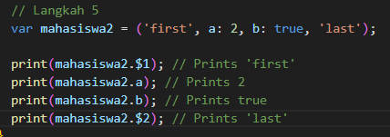

**Screenshot Hasil run**

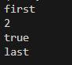

**Perbaikan kode dengan mengganti salah satu isi record dengan nama dan NIM**
``` dart
void main() {
  // Langkah 5
  var mahasiswa2 = ('first', a: 244107060109, b: true, 'Fiza');

  print(mahasiswa2.$1); // Prints 'first'
  print(mahasiswa2.a); // Prints 244107060109
  print(mahasiswa2.b); // Prints true
  print(mahasiswa2.$2); // Prints 'Fiza'
}

```

**Screenshot Hasil run perbaikan**

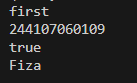

**Penjelasan**

Program berjalan tanpa error. Variabel mahasiswa2 merupakan record yang memiliki positional field ('first' dan 'last') serta named field (a:2 dan b: true). Field positional diakses menggunakan $1, $2 sedangkan field bernama diakses menggunakan nama field seperti .a dan .b. Kemudian record diubah sehingga $2 berisi nama ('Fiza') dan field a berisi nim (244107060109). Hal ini menunjukkan bahwa pada record di Dart, data dapat diakses baik berdasarkan urutan posisi maupun nama field yang telah didefinisikan.

---

## Tugas

### 2. Jelaskan yang dimaksud Functions dalam bahasa Dart

**jawab**

Function dalam dart adalah blok kode yang digunakan untuk menjalankan tugas tertentu dan dapat dipanggil kembali ketika dibutuhkan yang dimana dapat menerima parameter, menjalankan proses tertenty dan mengembalikan nilai. Dalam dart semua fungsi memiliki tipe function karena fungsi dianggap sebagai objek

**contoh 1**

``` dart
bool isNoble(int atomicNumber) {
  return atomicNumber == 2;
}
```

**contoh 2**

``` dart
int add(int a, int b) {
    // Creating function
    int result = a + b;
    // returning value result
    return result;
}

void main() {
    // Calling the function
    var output = add(10, 20);
    // Printing output
    print(output);
}
```

### 3. Jelaskan jenis-jenis parameter di Functions beserta contoh sintaksnya!

**jawab**

Parameter digunakan untuk menerima nilai dari luar function ketika function dipanggil. Terdapat beberapa jenis parameter dalam dart:

**a. Required Positional Parameter** 

Merupakan parameter yang harus diisi saat function dipanggil. Parameter ditulis di dalam tanda kurung () dan urutan nilai yang diberikan harus sesuai dengan urutan parameter yang dideklarasikan pada fuction

**contoh**
``` dart
void sayHello(String name) {
  print("Hello $name");
}

void main() {
  sayHello("Fiza");
}
```

Pada contoh tersebut parameter name harus diisi ketika function sapa() dipanggil

**b. Optional Positional Parameter** 

Merupakan parameter tambahan yang bersifat opsional. Parameter ditulis dengan tanda kurung siku []. Jika parameter tidak diisi maka nilainya akan menjadi null atau menggunakan nilai default

**contoh**
``` dart
String sapa(String nama, [String? pesan]) {
  return "$nama berkata $pesan";
}

void main() {
  print(sapa("Fiza"));
  print(sapa("Fiza", "Halo"));
}
```

Pada contoh tersebut parameter pesan berdifat opsional sehingga fuction tetep dapat dijalankan meskipun parameter tidak diisi

**c. Named Parameter** 

Merupakan parameter yang dipanggil menggunakan nama parameternya, bukan berdasarkan urutan. Parameter ditulis dengan tanda kurung kurawal {}. Membuat kode lebih mudah dibaca dan lebih fleksibel karena urutan pengisian parameter tidak harus sama dengan urutan deklarasi.

**contoh**
``` dart
void dataMahasiswa({String? nama, int? umur}) {
  print("Nama: $nama");
  print("Umur: $umur");
}

void main() {
  dataMahasiswa(umur: 20, nama: "Fiza");
}
```

Pada contoh tersebut parameter nama dan umur adalah named parameter. Saat pemanggilan function harus menyebutkan nama parameternya seperti nama: dan umur: dan tidak harus sama dengan urutan deklarasi.

Named parameter juga dapat dibuat wajib diisi menggunakan keyword required. Jika parameter ini tidak diberikan saat function dipanggil, maka akan terjadi error.

**contoh**
``` dart
void mahasiswa({required String nama, required int nim}) {
  print("Nama: $nama");
  print("NIM: $nim");
}

void main() {
  mahasiswa(nama: "Fiza", nim: 244107060109);
}
```

Pada contoh tersebut parameter nama dan nim merupakan required named parameter yang dimana saat fuction dipanggi kedua parameter harus diberikan nilainya. Jika salah satu tidak diisi maka akan menampilkan error

### 4. Jelaskan maksud Functions sebagai first-class objects beserta contoh sintaknya!

**jawab**

Function yang diperlakukan sebagai first-class object berarti fuction dapat diperlakukan seperti objek atau data lainnya yang dimana dapat disimpan dalam variabel, dikirim, sebagai parameter ke function lain, maupun dikembalikan sebagai nilai dari sebuah function

**contoh**
``` dart
void printElement(int element) {
  print(element);
}

var list = [1, 2, 3];
list.forEach(printElement);
```

Pada contoh tersebut function printElement dikirim sebagai parameter ke method forEach() sehingga function dapat diperlakukan seperti objek biasa

### 5. Apa itu Anonymous Functions? Jelaskan dan berikan contohnya!

**jawab**

Anonymous Functions adalah fuction yang tidak memiliki nama dan biasanya digunakan langsung sebagai ekspresi atau parameter pada function lain. Anonymous function memiliki parameter dan body seperti function biasa, tetapi tidak memiliki identifier.

**contoh**

``` dart
void main() {
  var list = ['apples', 'bananas', 'oranges'];

  list.forEach((item) {
    print(item);
  });
}
```

Pada contoh tersbeut function (item) { print(item); } merupakan anonymous function yang digunakan untuk mencetak setiap elemen dalam list.

### 6. Jelaskan perbedaan Lexical scope dan Lexical closures! Berikan contohnya!

**jawab**

**a. Lexical Scope**

Merupakan urutan aturan yang menentukan variabel hanya dapat diakses dalam ruang lingkup tempat variabel tersebut dideklarasikan. Function yang berada di dalam function lain dapat mengakses variabel yang ada di scope luar selama masih berada dalam lingkup kode yang sama. Scope ditentukan oleh struktur kode atau posisi kurung kurawal {}

**contoh**

``` dart
bool topLevel = true;

void main() {
  var insideMain = true;

  void myFunction() {
    var insideFunction = true;

    void nestedFunction() {
      var insideNestedFunction = true;

      assert(topLevel);
      assert(insideMain);
      assert(insideFunction);
      assert(insideNestedFunction);
    }
  }
}
```

Pada contoh tersebut , fungsi nestedFunction() dapat mengakses variabel topLevel, insideMain, insideFunction, dan insideNestedFunction karena variabel tersebut berada scope yang sama atau lebih luar.

**b. Lexical Closures**

Merupakan function yang dapat mengakses variabel dari scope luar meskipun function tersebut dijalankan di tempat yang berbeda atau setelah function luar selesai dijalankan.

**contoh**

``` dart
Function makeAdder(int addBy) {
  return (int i) => addBy + i;
}

void main() {
  var add2 = makeAdder(2);
  var add4 = makeAdder(4);

  print(add2(3));
  print(add4(3));
}
```

Pada contoh tersebut function yang dikembalikan oleh makeAdder() tetap dapat mengakses variabel addBy

### 7. Jelaskan dengan contoh cara membuat return multiple value di Functions!

**jawab**

Dart memungkinkan sebuah function mengembalikan lebih dari satu nilai menggunakan Record yang dimana merupakan struktur data yang dapat menyimpan beberapap nilai dengan tipe berbeda dalam satu variabel

**contoh**

``` dart
(String, int) getDataMahasiswa() {
  return ("Fiza", 244107060109);
}

void main() {
  var data = getDataMahasiswa();
  print(data.$1);
  print(data.$2);
}
```

Pada contoh tersebut function mengembalikan dua nilai yaitu String dan int dalam bentuk record. Selain itu nilai record juga dapat langsung dipisahkan dengan destructuring

``` dart
(String, int) getDataMahasiswa() {
  return ("Fiza", 244107060109);
}

void main() {
  var (nama, nim) = getDataMahasiswa();
  print(nama);
  print(nim);
}
```