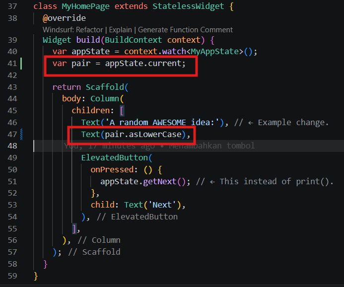

# Laporan Tugas CodeLabs

## Identitas Mahasiswa

| Atribut | Nilai                       |
| ------- | -----                       |
| Nama    | Fiza Rahmatus Sholikha      |
| NIM     | 244107060109                |
| Kelas   | SIB-2E                      |

[LINK REPOSITORY KODE](https://github.com/Fizzrss/flutter_application_1)

---

## 3. Membuat Projek

### Membuat proyek Flutter pertama Anda

Luncurkan Visual Studio Code dan buka palet perintah (dengan F1 atau Ctrl+Shift+P atau Shift+Cmd+P). Ketik "flutter new". Pilih perintah Flutter: New Project.

.png)

Berikutnya, pilih Application lalu folder tempat proyek akan dibuat. Folder ini dapat berupa direktori utama Anda, atau direktori seperti C:\src\.

Terakhir, beri nama proyek Anda. Beri nama seperti namer_app atau my_awesome_namer.

.png)

.png)

Flutter kini membuat folder proyek Anda dan VS Code membuka folder tersebut.

> **Catatan:** VS Code menampilkan jendela modal yang menanyakan untuk mempercayai isi folder tersebut.
.png)

Pilih Ya. Opsi lainnya menonaktifkan fungsi penting Flutter.

### Menyalin & Menempelkan aplikasi awal

Pada panel sebelah kiri VS Code, pastikan bahwa Penjelajah dipilih lalu buka file pubspec.yaml.

.png)

Ganti konten file ini dengan kode berikut:

.png)

File pubspec.yaml menentukan informasi dasar tentang aplikasi Anda, seperti versi aplikasi saat ini, dependensi aplikasi, dan aset yang digunakan oleh aplikasi untuk pengiriman.

> **Catatan:** Jika Anda memberi aplikasi nama selain namer_app, Anda perlu mengubah baris pertama sesuai nama yang Anda berikan.

Berikutnya, buka file konfigurasi lainnya dalam proyek tersebut, analysis_options.yaml.

.png)

Ganti konten file tersebut dengan kode berikut:

.png)

File ini menentukan seberapa ketat Flutter saat menganalisis kode Anda. Karena percobaan ini adalah percobaan pertama Anda menggunakan Flutter, Anda memberi tahu penganalisis agar tidak terlalu ketat. Anda dapat mengatur ini kapan saja. Bahkan, seiring mendekati pemublikasian aplikasi produksi sebenarnya, Anda kemungkinan besar akan ingin membuat penganalisis lebih ketat dari ini.

Terakhir, buka file main.dart pada direktori lib/.

.png)

Ganti konten file ini dengan kode berikut:

.png)

---

## 4. Menambah Tombol

### Meluncurkan aplikasi

Pertama, buka lib/main.dart dan pastikan Anda memilih perangkat target. Di bagian pojok kanan bawah VS Code, Anda akan menemukan tombol yang menampilkan perangkat target saat ini. Klik tombol untuk mengubahnya.

.png)

Selagi lib/main.dart terbuka, temukan tombol "play" b0a5d0200af5985d.png di pojok kanan atas jendela VS Code lalu klik tombol tersebut.

.png)

Setelah beberapa saat, aplikasi Anda diluncurkan dalam mode debug. Tampilannya masih terlihat biasa saja:

.png)

### Hot Reload Pertama

Di bagian bawah lib/main.dart, tambahkan sesuatu pada string di objek Text pertama, dan simpan file tersebut (dengan Ctrl+S atau Cmd+S). Misalnya:

.png)

Perhatikan bagaimana aplikasi segera berubah tetapi kata yang acak tetap sama. Situasi ini menunjukkan fitur stateful Hot Reload Flutter terkenal yang sedang bekerja. Hot reload dipicu saat Anda menyimpan perubahan untuk file sumber.

.png)

### Menambahkan tombol

Berikutnya, tambahkan tombol di bagian bawah Column, tepat di bawah instance Text kedua.

.png)

Saat Anda menyimpan perubahan, aplikasi diperbarui kembali: Sebuah tombol muncul dan, saat Anda mengklik tombol tersebut, Konsol Debug di VS Code menampilkan pesan button pressed!.

.png)

### Perilaku pertama Anda

Scroll ke MyAppState lalu tambahkan metode getNext.

.png)

.png)

Metode getNext() baru menetapkan ulang current dengan WordPair acak baru. Metode ini juga memanggil notifyListeners()(metode ChangeNotifier) yang memastikan bahwa semua orang yang melihat MyAppState diberi tahu.

Tindakan terakhir adalah memanggil metode getNext dari callback tombol tersebut.

.png)

.png)

Simpan dan uji coba aplikasi sekarang. Aplikasi akan menghasilkan pasangan kata acak baru setiap kali Anda menekan tombol Next.

Pada bagian berikutnya, Anda akan memperindah tampilan antarmuka pengguna.

---

## 5. Memperindah Tampilan Aplikasi

### Mengekstrak widget

Baris yang bertanggung jawab untuk menampilkan pasangan kata saat ini kini tampak seperti berikut: Text(appState.current.asLowerCase). Untuk mengubahnya menjadi sesuatu yang lebih kompleks, disarankan untuk mengekstrak baris ini ke widget terpisah. Memiliki beberapa widget untuk beberapa bagian logis dari UI Anda adalah cara penting dalam mengelola kompleksitas pada Flutter.

Flutter menyediakan pembantu pemfaktoran ulang untuk mengekstrak widget, tetapi sebelum Anda menggunakannya, pastikan bahwa baris yang akan diekstrak hanya mengakses yang diperlukan. Sekarang baris tersebut mengakses appState, tetapi sebenarnya baris tersebut hanya perlu mengetahui apa pasangan kata saat ini.

Oleh karena itu, tulis ulang widget MyHomePage sebagai berikut:

Bagus. Widget Text tidak lagi merujuk kepada keseluruhan appState.

Sekarang, panggil menu Refactor. Pada VS Code, Anda melakukan ini melalui salah satu dari dua cara:
1. Klik kanan potongan kode yang ingin Anda faktorkan ulang (dalam hal ini Text) dan pilih Refactor... dari menu drop-down,
ATAU
2. Pindahkan kursor Anda ke potongan kode yang ingin Anda faktorkan ulang (dalam hal ini, Text), lalu tekan Ctrl+. (Win/Linux) atau Cmd+. (Mac).

.png)

.png)

.png)

.png)

Pada menu Refactor, pilih Extract Widget. Tetapkan nama, seperti BigCard, lalu klik Enter.

Tindakan ini secara otomatis membuat class baru, BigCard, di akhir file saat ini. Class tersebut akan terlihat seperti berikut:

.png)

Perhatikan bagaimana aplikasi tetap berjalan meskipun pemfaktoran ulang sedang berlangsung.

### Menambahkan Kartu

Sekarang saatnya membuat widget baru ini menjadi UI tebal yang kita bayangkan di awal bagian ini.

Temukan class BigCard dan metode build() yang berada di dalamnya. Sama seperti sebelumnya, panggil menu Refactor pada widget Text. Namun, kali ini Anda tidak akan mengekstrak widget.

Sebagai gantinya, pilih Wrap with Padding. Tindakan ini menciptakan widget induk baru di sekitar widget Text bernama Padding. Setelah menyimpannya, Anda akan melihat bahwa kata acak tersebut telah memiliki ruang yang lebih luas.

.png)

.png)

.png)

.png)

Tingkatkan padding dari nilai default 8.0. Misalnya, gunakan 20 untuk padding yang lebih luas.

>**Catatan:** Flutter menggunakan Komposisi, bukan Pewarisan, kapan pun tersedia. Di sini, padding tidak menjadi atribut dari Text, melainkan sebuah widget!
>Dengan begitu, widget dapat fokus pada tanggung jawab masing-masing, dan Anda, sebagai developer, memiliki kebebasan penuh mengenai cara menyusun UI. Misalnya, Anda dapat menggunakan widget Padding untuk memberikan padding pada teks, gambar, tombol, widget kustom Anda sendiri, atau keseluruhan aplikasi. Widget tidak peduli dengan apa yang dikemas.

Berikutnya, mari kita naik satu tingkat lebih tinggi. Tempatkan kursor Anda pada widget Padding, buka menu Refactor, lalu pilih Wrap with widget....

Tindakan ini memungkinkan Anda untuk menentukan widget induk. Ketik "Card" dan tekan Enter.

.png)

.png)

.png)

.png)

### Tema dan Gaya

menjaga skema warna yang konsisten, gunakan Theme aplikasi untuk memilih warna.

Buat perubahan berikut untuk metode build() BigCard.

.png)

Kedua baris baru ini melakukan banyak hal:

- Pertama, kode ini meminta tema aplikasi saat ini dengan Theme.of(context).
- Kemudian, kode ini menentukan warna kartu agar sama dengan properti colorScheme dari tema. Skema warna menampung banyak warna, dan primary adalah warna aplikasi yang paling terlihat dan mencolok.

Kini, kartu telah diwarnai dengan warna primer aplikasi:

.png)

Anda dapat mengubah warna ini serta skema warna keseluruhan aplikasi dengan men-scroll ke atas ke MyApp dan mengubah warna seed untuk ColorScheme di sana.

> **Tips:** Class Colors Flutter memberikan akses mudah ke palet warna pilihan kepada Anda, seperti Colors.deepOrange atau Colors.red. Namun, pastinya Anda dapat memilih warna apa saja. Misalnya, untuk menentukan warna hijau murni dengan opasitas penuh, gunakan Color.fromRGBO(0, 255, 0, 1.0). Jika Anda adalah penggemar angka heksadesimal, selalu ada Color(0xFF00FF00).

.png)

Perhatikan bagaimana warna berubah dengan halus. Perubahan ini disebut animasi implisit. Banyak widget Flutter akan berinterpolasi antarnilai dengan lancar agar UI tidak hanya "berpindah" antarstatus.

Tombol timbul di bawah kartu juga berubah warna. Itulah kelebihan dalam menggunakan Theme seluruh aplikasi dibandingkan dengan nilai hard-code.

### TextTheme

Kartu tersebut masih memiliki masalah: ukuran teks terlalu kecil dan warnanya membuat teks sulit dibaca. Untuk memperbaiki masalah ini, buat perubahan berikut pada metode build() BigCard.

.png)

Yang ada di balik perubahan ini:

- Dengan menggunakan theme.textTheme,, Anda mengakses tema font aplikasi. Class ini mencakup anggota seperti bodyMedium (untuk teks standar ukuran medium), caption (untuk teks dari gambar), atau headlineLarge (untuk judul berukuran besar).
- Properti displayMedium adalah gaya font besar yang dimaksudkan untuk teks tampilan. Kata tampilan digunakan dalam artian tipografi di sini, seperti pada jenis huruf tampilan. Dokumentasi untuk displayMedium menyatakan bahwa, "gaya tampilan ditujukan untuk teks yang penting dan singkat"—tepat dengan kasus penggunaan kita.
- Properti displayMedium tema secara teori dapat berupa null. Dart, bahasa pemrograman yang Anda gunakan untuk menulis aplikasi ini, aman dari null, sehingga bahasa pemrograman ini tidak akan mengizinkan Anda memanggil metode objek yang berpotensi null. Namun, dalam hal ini, Anda dapat menggunakan operator ! ("bang operator") untuk meyakinkan Dart bahwa Anda memahami tindakan Anda. (displayMedium pasti tidak null dalam kasus ini. Namun, alasan kami mengetahui hal ini berada di luar cakupan codelab ini.)
- Memanggil copyWith() pada displayMedium menampilkan salinan gaya teks dengan perubahan yang Anda tentukan. Dalam hal ini, Anda hanya mengubah warna teks.
- Untuk mendapatkan warna baru, Anda mengakses tema aplikasi sekali lagi. Properti onPrimary skema warna menentukan warna yang cocok digunakan untuk warna primer aplikasi.

Kini, aplikasi akan terlihat seperti berikut:

.png)

Jika Anda mau, ubah kartu lebih jauh. Berikut beberapa idenya:

- copyWith() memungkinkan Anda mengubah lebih banyak tentang gaya teks daripada hanya warna. Untuk mendapatkan daftar lengkap properti yang dapat Anda ubah, letakkan kursor di dalam tanda kurung copyWith(), lalu tekan Ctrl+Shift+Space (Win/Linux) atau Cmd+Shift+Space (Mac).
- Anda juga dapat mengubah lebih banyak tentang widget Card. Misalnya, Anda dapat memperbesar bayangan kartu dengan meningkatkan nilai parameter elevation.
- Coba bereksperimen dengan warna. Selain theme.colorScheme.primary, ada juga .secondary, .surface, dan berbagai pilihan lainnya. Semua warna ini memiliki onPrimary padanannya masing-masing.

### Meningkatkan aksesibilitas

Flutter membuat aplikasi     dapat diakses secara default. Misalnya, setiap aplikasi Flutter menampilkan semua teks dan elemen interaktif di aplikasi dengan tepat untuk pembaca layar, seperti TalkBack dan VoiceOver.

Namun, terkadang diperlukan pengerjaan tambahan. Dalam kasus aplikasi ini, pembaca layar mungkin mengalami masalah dalam melafalkan beberapa pasangan kata yang dihasilkan. Meskipun manusia tidak mengalami masalah dalam mengidentifikasi kedua kata pada pasangan kata cheaphead, pembaca layar dapat melafalkan ph di tengah kata sebagai f.

Solusi sederhananya adalah dengan mengganti pair.asLowerCase dengan "${pair.first} ${pair.second}". Kode kedua menggunakan jenis interpolasi string untuk membuat string (seperti "cheap head") dari kedua kata yang tercakup dalam pair. Menggunakan dua kata terpisah sebagai ganti kata majemuk memastikan bahwa pembaca layar mengidentifikasi setiap kata dengan tepat, dan menyediakan pengalaman yang lebih baik untuk pengguna penyandang gangguan penglihatan.

Namun, Anda mungkin ingin mempertahankan kesederhanaan visual pair.asLowerCase. Gunakan properti semanticsLabel Text untuk mengganti konten visual widget teks dengan konten semantik yang lebih sesuai untuk pembaca layar:

.png)

.png)

Kini, pembaca layar melafalkan setiap pasangan kata yang dihasilkan dengan tepat, namun UI tidak berubah. Coba praktikkan ini dengan menggunakan pembaca layar di perangkat Anda.

> **Tips:** Flutter memiliki berbagai alat untuk aksesibilitas, termasuk pengujian otomatis dan widget Semantics. Pelajari lebih lanjut pada halaman Aksesibilitas dokumentasi Flutter.

### Menempatkan UI di tengah

Setelah pasangan kata acak dihadirkan dengan gaya visual yang cukup, saatnya menempatkan UI di tengah jendela/layar aplikasi.

Pertama, ingatlah bahwa BigCard adalah bagian dari Column. Secara default, kolom menggabungkan turunan kolom di bagian atas, tetapi kita dapat mengganti ini dengan mudah. Buka metode build() MyHomePage, dan buat perubahan berikut:

.png)

Tindakan ini menempatkan turunan dalam Column di tengah pada sumbu utamanya (vertikal).

.png)

Turunan UI telah ditempatkan di tengah pada sumbu silang kolom (dengan kata lain, turunan UI telah ditempatkan di tengah secara horizontal). Namun, Column itu sendiri tidak ditempatkan di tengah dalam Scaffold. Kita dapat memverifikasi ini menggunakan Widget Inspector.

.png)

.png)

Widget Inspector itu sendiri berada di luar cakupan codelab ini, tetapi Anda dapat melihat bahwa ketika Column ditandai, kode ini tidak menghabiskan keseluruhan lebar aplikasi. Kode ini hanya menghabiskan ruang horizontal sebanyak yang diperlukan oleh turunan UI.

Anda dapat menempatkan kolom itu sendiri di tengah. Letakkan kursor Anda di Column, buka menu Refactor (dengan Ctrl+. atau Cmd+.), lalu pilih Wrap with Center.

.png)

.png)

Kini, aplikasi akan terlihat seperti berikut:

.png)

Jika mau, Anda dapat menyesuaikan tampilan ini lebih lanjut.

- Anda dapat menghapus widget Text di atas BigCard. Dapat dipastikan bahwa teks deskriptif ("Ide LUAR BIASA acak:") tidak lagi diperlukan karena UI tersebut sudah jelas meskipun tanpa teks deskriptif. Selain itu, dengan begitu UI terlihat lebih bersih.
- Anda juga dapat menambahkan widget SizedBox(height: 10) di antara BigCard dan ElevatedButton. Dengan begitu, ada sedikit pemisah di antara kedua widget tersebut. Widget SizedBox hanya mengambil ruang dan tidak merender apa pun dengan sendirinya. Widget ini biasa digunakan untuk membuat "jarak" visual.

Dengan perubahan opsional, MyHomePage mencakup kode berikut:

.png)

.png)

## 6. Menambahkan Fungsi

### Menambahkan logika bisnis

Scroll ke MyAppState dan tambahkan kode berikut:

.png)

Periksa perubahannya:

- Anda menambahkan properti baru pada MyAppState yang bernama favorites. Properti ini diinisialisasi dengan daftar kosong: [].
- Anda juga menentukan bahwa daftar tersebut hanya dapat berisi pasangan kata: <WordPair>[], menggunakan generik. Hal ini membantu membuat aplikasi Anda menjadi lebih lengkap—Dart bahkan menolak menjalankan aplikasi jika Anda mencoba menambahkan apa pun selain WordPair. Oleh karena itu, Anda dapat menggunakan daftar favorites karena tidak boleh ada objek yang tidak diinginkan (seperti null) yang bersembunyi di dalamnya.

> **Catatan:** Dart memiliki jenis koleksi selain List (ditunjukkan dengan []). Anda dapat berpendapat bahwa Set (ditunjukkan dengan {}) akan lebih masuk akal untuk koleksi favorit. Untuk membuat codelab ini sesederhana mungkin, kita hanya menggunakan satu daftar. Namun, jika mau, Anda dapat menggunakan Set sebagai gantinya. Kode ini tidak akan mengubah banyak.

- Anda juga menambahkan metode baru, toggleFavorite(), yang menghapus pasangan kata saat ini dari daftar favorit (jika sudah ada), atau menambahkannya (jika belum ada). Dalam kedua kasus tersebut, kode memanggil notifyListeners(); setelahnya.

### Menambahkan tombol

Dengan terselesaikannya "logika bisnis", saatnya untuk mengerjakan antarmuka pengguna kembali. Meletakkan tombol ‘Like' di sebelah kiri tombol ‘Next' memerlukan Row. Widget Row adalah padanan horizontal dari Column, yang telah Anda lihat sebelumnya.

Pertama, gabungkan tombol yang ada pada Row. Buka metode build() MyHomePage, letakkan kursor pada ElevatedButton, buka menu Refactor dengan Ctrl+. atau Cmd+., lalu pilih Wrap with Row.

.png)

.png)

.png)

Saat menyimpan, Anda akan menyadari bahwa Row bertindak mirip dengan Column—secara default, kode ini mengumpulkan turunannya ke sebelah kiri. (Column mengumpulkan turunannya ke atas.) Untuk memperbaiki masalah ini, Anda dapat menggunakan pendekatan yang sama seperti sebelumnya, tetapi dengan mainAxisAlignment. Namun, untuk tujuan mendidik (pembelajaran), gunakan mainAxisSize. Kode ini memberi tahu Row agar tidak mengambil semua ruang horizontal yang tersedia.

.png)

UI kembali ke tempat sebelumnya.

.png)

Berikutnya, tambahkan tombol Like dan hubungkan ke toggleFavorite(). Sebagai tantangan, coba lakukan sendiri untuk pertama kali, tanpa melihat blok kode di bawah.

Berikut satu cara untuk menambahkan tombol kedua untuk MyHomePage. Kali ini, gunakan konstruktor ElevatedButton.icon() untuk membuat tombol dengan ikon. Di bagian atas metode build, pilih ikon yang sesuai tergantung pada apakah pasangan kata saat ini sudah berada di favorit atau tidak. Selain itu, perhatikan penggunaan SizedBox lagi, untuk menjaga jarak antara kedua tombol.

.png)

.png)

.png)

## 7. Menambahkan Kolom Samping Navigasi

Sebagian besar aplikasi tidak dapat memuat semuanya ke dalam satu layar. Aplikasi ini mungkin dapat melakukannya, tetapi untuk tujuan pembelajaran, Anda akan membuat layar terpisah untuk bagian favorit pengguna. Untuk beralih di antara dua layar, Anda akan menerapkan StatefulWidget pertama Anda.

Untuk mencapai inti dari langkah ini secepat mungkin, pisahkan MyHomePage menjadi 2 widget terpisah.

Pilih keseluruhan MyHomePage, hapus, dan gantikan dengan kode berikut:

.png)

Saat disimpan, Anda akan melihat sisi visual UI telah siap—tetapi tidak bekerja. Mengklik ♥︎ (hati) pada kolom samping navigasi tidak melakukan apa pun.

.png)

.png)

Periksa perubahannya.

- Pertama, perhatikan bahwa seluruh konten MyHomePage diekstrak ke dalam widget baru, GeneratorPage. Satu-satunya bagian dari widget MyHomePage lama yang tidak diekstrak adalah Scaffold.
- MyHomePage baru berisi Row dengan dua turunan. Widget pertama adalah SafeArea, dan yang kedua adalah widget Expanded.
- SafeArea memastikan bahwa turunannya tidak terhalang oleh notch hardware atau status bar. Dalam aplikasi ini, widget mengemas NavigationRail untuk mencegah tombol navigasi terhalang oleh status bar perangkat seluler, misalnya.
- Anda dapat mengubah baris extended: false pada NavigationRail menjadi true. Kode ini menampilkan label di samping ikon. Pada langkah mendatang, Anda akan mempelajari cara melakukan ini secara otomatis saat aplikasi memiliki ruang horizontal yang cukup.
- Kolom samping navigasi memiliki dua tujuan (Beranda dan Favorit), dengan ikon dan label masing-masing. Kolom samping navigasi juga menentukan selectedIndex saat ini. Indeks pilihan nol memilih tujuan pertama, indeks pilihan satu memilih tujuan kedua, dan seterusnya. Untuk saat ini, kolom samping navigasi di-hard code ke nol.
- Kolom samping navigasi juga menentukan apa yang terjadi saat pengguna memilih salah satu tujuan dengan onDestinationSelected. Saat ini, aplikasi hanya menghasilkan nilai indeks yang diminta dengan print().
- Turunan kedua Row adalah widget Expanded. Widget yang diperluas sangat berguna dalam baris dan kolom—widget tersebut memungkinkan Anda mengekspresikan tata letak tempat beberapa turunan hanya mengambil ruang sebanyak yang diperlukan (dalam hal ini, NavigationRail) dan widget lainnya harus mengambil ruang yang tersisa sebanyak mungkin (dalam hal ini, Expanded). Satu sudut pandang tentang widget Expanded adalah bahwa widget ini "serakah". Jika Anda ingin lebih memahami peran widget ini, coba gabungkan widget NavigationRail dengan Expanded lainnya. Tata letak yang dihasilkan terlihat seperti berikut:
- Dua widget Expanded saling berbagi semua ruang horizontal yang tersedia, meskipun kolom samping navigasi hanya memerlukan sepotong kecil ruang di sisi kiri.
- Di dalam widget Expanded, ada Container berwarna, dan ada GeneratorPage di dalam container.

### Widget stateless versus stateful

Sampai sekarang, MyAppState telah memenuhi semua kebutuhan status Anda. Itulah mengapa semua widget yang telah Anda tulis sejauh ini adalah stateless. Widget-widget tersebut tidak memiliki status yang dapat diubah. Tidak ada widget yang dapat mengubah widget itu sendiri—widget tersebut harus melalui MyAppState.

Hal ini akan segera berubah.

Anda memerlukan suatu cara untuk menyimpan nilai selectedIndex kolom samping navigasi. Anda juga ingin dapat mengubah nilai ini dari dalam callback onDestinationSelected.

Anda dapat menambahkan selectedIndex sebagai properti tambahan MyAppState. Kode tersebut akan berfungsi. Namun, Anda dapat membayangkan bahwa status aplikasi akan tumbuh dengan cepat di luar kendali jika setiap widget menyimpan nilai masing-masing di dalamnya.

Sebagian status hanya relevan untuk satu widget, sehingga status tersebut harus tetap dengan widget tersebut.

Masukkan StatefulWidget, jenis widget yang memiliki State. Pertama, konversi MyHomePage menjadi widget stateful.

Tempatkan kursor Anda di baris pertama MyHomePage (baris yang diawali dengan class MyHomePage...), lalu buka menu Refactor menggunakan Ctrl+. atau Cmd+.. Kemudian, pilih Convert to StatefulWidget.

.png)

.png)

IDE membuat class baru untuk Anda, _MyHomePageState. Class ini memperluas State sehingga dapat mengelola nilainya sendiri. (Class ini dapat mengubah dirinya sendiri.) Perhatikan juga bahwa metode build dari widget stateless yang lama telah berpindah ke _MyHomePageState (bukannya tetap di widget). Metode berpindah secara bertahap—tidak ada yang diubah dalam metode build. Metode ini sekarang menetap di tempat lain.

> Garis bawah (_) di awal _MyHomePageState membuat class tersebut menjadi class pribadi dan diterapkan oleh compiler. Jika Anda ingin mengetahui lebih lanjut tentang Dart dan topik-topik lainnya, baca artikel Tur Bahasa.

### setState

Widget stateful baru hanya perlu melacak satu variabel: selectedIndex. Buat 3 perubahan berikut untuk _MyHomePageState:

.png)

Periksa perubahannya:

1. Anda memperkenalkan variabel baru, selectedIndex, dan melakukan inisialisasi menjadi 0.
2. Anda menggunakan variabel baru ini dalam definisi NavigationRail sebagai ganti 0 yang di-hard-code dan ada di sana sampai sekarang.
3. Saat callback onDestinationSelected dipanggil, sebagai ganti hanya mencetak nilai baru ke konsol, Anda menetapkan nilai tersebut ke selectedIndex di dalam panggilan setState(). Panggilan ini mirip dengan metode notifyListeners() yang digunakan sebelumnya—metode ini memastikan bahwa UI selalu diupdate.

.png)

.png)

Kolom samping navigasi kini merespons interaksi pengguna. Namun, area yang diperluas di sebelah kanan tetap sama. Hal itu karena kode tidak menggunakan selectedIndex untuk menentukan apa yang ditampilkan di layar.

### Menggunakan selectedIndex

Tempatkan kode berikut di bagian atas metode build _MyHomePageState, tepat sebelum return Scaffold:

.png)

Periksa potongan kode berikut:

1. Kode tersebut mendeklarasikan variabel baru, page, dari jenis Widget.
2. Kemudian, pernyataan switch menetapkan layar untuk page, berdasarkan nilai saat ini pada selectedIndex.
3. Karena belum ada FavoritesPage, gunakan Placeholder; sebuah widget praktis yang menggambar kotak silang di tempat yang Anda pilih, menandai bagian UI tersebut sebagai tidak tuntas.
4. Dengan menerapkan prinsip gagal cepat, pernyataan switch juga memastikan untuk menampilkan kesalahan jika selectedIndex bukan 0 atau 1. Hal ini membantu mencegah munculnya bug. Jika Anda menambahkan tujuan baru ke kolom samping navigasi dan lupa mengupdate kode ini, program akan mengalami error dalam pengembangan (bukan membiarkan Anda menebak kenapa tidak bekerja, atau membiarkan Anda menerbitkan kode berisi bug ke dalam produksi).

Kini, setelah page berisi widget yang ingin Anda tampilkan di sebelah kanan, Anda mungkin dapat menebak perubahan apa lagi yang diperlukan.

Berikut tampilan _MyHomePageState setelah satu perubahan tersebut:

.png)

Aplikasi sekarang beralih di antara GeneratorPage kita dan placeholder yang akan segera menjadi halaman Favorites.

.png)

.png)

### Tingkat respons

Berikutnya, buat kolom samping navigasi menjadi responsif. Dengan kata lain, buat agar kolom samping navigasi menampilkan label secara otomatis (menggunakan extended: true) saat ada ruang yang cukup.

Flutter menyediakan berbagai widget yang membantu membuat aplikasi Anda menjadi responsif secara otomatis. Misalnya, Wrap adalah widget yang mirip dengan Row atau Column yang secara otomatis menggabungkan turunan ke "baris" berikutnya (yang disebut "run") saat ruang vertikal atau horizontal tidak mencukupi. Ada FittedBox, sebuah widget yang secara otomatis memasukkan turunannya ke dalam ruang yang tersedia berdasarkan spesifikasi Anda.

Namun, NavigationRail tidak secara otomatis menampilkan label saat ruang tidak cukup karena kode tersebut tidak dapat mengetahui apa sebenarnya yang dimaksud dengan ruang yang cukup dalam setiap konteks. Pengambilan keputusan itu tergantung pada Anda sebagai developer.

Misalnya, Anda memutuskan untuk menampilkan label hanya jika lebar MyHomePage setidaknya 600 piksel.

> **Catatan:** Flutter bekerja dengan piksel logis sebagai unit panjang. Piksel ini juga terkadang disebut dengan piksel yang tidak tergantung perangkat. Padding dengan lebar 8 piksel secara visual sama terlepas dari apakah aplikasi berjalan pada ponsel tua dengan resolusi rendah atau perangkat 'retina' yang lebih baru. Ada sekitar 38 piksel logis per sentimeter, atau sekitar 96 piksel logis per inci, dari layar fisik.

Dalam hal ini, widget yang digunakan adalah LayoutBuilder. Widget ini memungkinkan Anda mengubah pohon widget tergantung pada seberapa banyak ruang yang tersedia yang dimiliki.

Sekali lagi, gunakan menu Refactor Flutter di VS Code untuk membuat perubahan yang diperlukan. Namun, proses kali ini sedikit lebih rumit:

1. Dalam metode build _MyHomePageState, letakkan kursor Anda pada Scaffold.
2. Buka menu Refactor dengan Ctrl+. (Windows/Linux) atau Cmd+. (Mac).
3. Pilih Wrap with Builder dan tekan Enter.
4. Modifikasi nama Builder yang baru ditambahkan menjadi LayoutBuilder.
5. Modifikasi daftar parameter callback dari (context) menjadi (context, constraints).

.png)

.png)

.png)

Callback builder LayoutBuilder dipanggil setiap kali batasan berubah. Misalnya, hal ini terjadi saat:

- Pengguna mengubah ukuran jendela aplikasi
- Pengguna memutar ponsel mereka dari mode potret menjadi mode lanskap, atau sebaliknya
- Beberapa widget di samping MyHomePage membesar, sehingga membuat batasan MyHomePage mengecil
- Dan seterusnya

Sekarang kode Anda dapat memutuskan untuk menampilkan label dengan membuat kueri constraints saat ini atau tidak. Buat perubahan baris tunggal berikut untuk metode build _MyHomePageState:

.png)

Sekarang aplikasi Anda merespons lingkungannya, seperti ukuran layar, orientasi, dan platform. Dengan kata lain, aplikasi Anda sudah responsif.

.png)

.png)

## 8. Menambahkan Halaman Baru

Jika Anda ingin mencoba hal baru, coba lakukan langkah ini sendiri. Tujuan Anda adalah menampilkan daftar favorites dalam widget stateless baru, FavoritesPage, lalu menampilkan widget tersebut, bukan Placeholder.

Berikut beberapa petunjuk untuk Anda:

- Jika Anda menginginkan Column yang dapat di-scroll, gunakan widget ListView.
- Ingat, akses instans MyAppState dari widget apa pun menggunakan context.watch<MyAppState>().
- Jika Anda juga ingin mencoba widget baru, ListTile memiliki properti seperti title (umumnya untuk teks), leading (untuk ikon atau avatar), dan onTap (untuk interaksi). Namun, Anda dapat mencapai efek serupa dengan widget yang sudah Anda ketahui.
- Dart memungkinkan penggunaan loop for dalam literal koleksi.

Di sisi lain, jika Anda lebih terbiasa dengan pemrograman fungsional, Dart juga memungkinkan Anda menulis kode seperti messages.map((m) => Text(m)).toList(). Tentu saja Anda selalu dapat membuat daftar widget dan mengisinya secara imperatif di dalam metode build.

Keuntungan menambahkan sendiri halaman Favorites adalah Anda belajar lebih banyak dengan membuat keputusan sendiri. Kekurangannya adalah Anda mungkin menemui masalah yang belum dapat Anda pecahkan sendiri. Ingat: tidak apa-apa untuk gagal, dan kegagalan adalah salah satu elemen terpenting pembelajaran. Tidak ada yang mengharapkan Anda berhasil dalam pengembangan Flutter pertama Anda, dan Anda pun seharusnya begitu.

Berikut ini hanyalah salah satu cara untuk menerapkan halaman favorit. Bagaimana halaman ini diterapkan (semoga) akan menginspirasi Anda untuk bermain dengan kode—meningkatkan UI dan membuat UI sesuai keinginan Anda.

Berikut class FavoritesPage baru:

.png)

.png)

Inilah fungsi widget tersebut:

- Widget ini mendapatkan status aplikasi saat ini.
- Jika daftar favorit kosong, pesan terpusat berikut akan ditampilkan: No favorites yet*.*
- Jika tidak, daftar (dapat di-scroll) akan ditampilkan.
- Daftar tersebut dimulai dengan ringkasan (misalnya, You have 5 favorites*.*).
- Kode tersebut kemudian melakukan iterasi di seluruh favorit dan membuat widget ListTile untuk masing-masing favorit.

Yang tersisa sekarang adalah mengganti widget Placeholder dengan FavoritesPage. Dan selesai!

.png)

.png)

.png)

.png)
