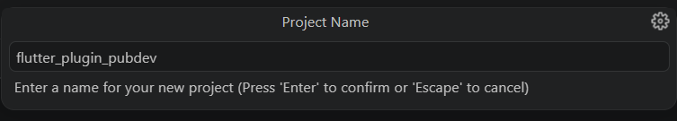
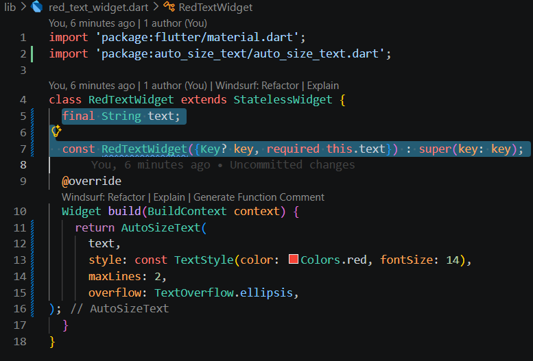

# Laporan Praktikum #07 - Manajemen Plugin

## Identitas Mahasiswa

| Atribut | Nilai                       |
| ------- | -----                       |
| Nama    | Fiza Rahmatus Sholikha      |
| NIM     | 244107060109                |
| Kelas   | SIB-2E                      |

[LINK REPOSITORY KODE PRAKTIKUM](https://github.com/Fizzrss/flutter_plugin_pubdev)

---

## Praktikum Menerapkan Plugin di Project Flutter

### Langkah 1: Buat Project Baru

Buatlah sebuah project flutter baru dengan nama flutter_plugin_pubdev. Lalu jadikan repository di GitHub Anda dengan nama flutter_plugin_pubdev.

### Langkah 2: Menambahkan Plugin

Tambahkan plugin auto_size_text menggunakan perintah berikut di terminal

.png)

Jika berhasil, maka akan tampil nama plugin beserta versinya di file pubspec.yaml pada bagian dependencies.

.png)

### Langkah 3: Buat file red_text_widget.dart

Buat file baru bernama red_text_widget.dart di dalam folder lib lalu isi kode seperti berikut.

.png)

.png)

### Langkah 4: Tambah Widget AutoSizeText

Masih di file red_text_widget.dart, untuk menggunakan plugin auto_size_text, ubahlah kode return Container() menjadi seperti berikut.

.png)

Setelah Anda menambahkan kode di atas, Anda akan mendapatkan info error. Mengapa demikian? Jelaskan dalam laporan praktikum Anda!

*jawab:*

Error pada kode tersebut disebabkan oleh widget AutoSizeText tidak dikenali karena package eksternalnya belum diimpor ke dalam berkas tersebut. Diperbaiki dengan cara menambahkan import untuk package:auto_size_text/auto_size_text.dart di bagian atas

**Perbaikan kode:**

.png)

Dalam Perbaikan tersebut kode masih error karena variabel text yang dipanggil di dalam fungsi build belum dideklarasikan di dalam kelas RedTextWidget. Kode diperbaiki dalam langkah selanjutnya yaitu langkah 5 dengan cara mendeklarasikan variabel final String text; yang kemudian dimasukkan ke dalam parameter konstruktor kelas agar widget dapat menerima dan menampilkan teks dinamis. Selain itu, peringatan pada konstruktor Key diselesaikan dengan menerapkan sintaks super.key sesuai dengan standar penulisan Dart

### Langkah 5: Buat Variabel text dan parameter di constructor

Tambahkan variabel text dan parameter di constructor seperti berikut.

### Langkah 6: Tambahkan widget di main.dart

Buka file main.dart lalu tambahkan di dalam children: pada class _MyHomePageState

.png)

.png)

Run aplikasi tersebut dengan tekan F5, maka hasilnya akan seperti berikut.

.png)

## TUGAS PRAKTIKUM

### 1. Selesaikan Praktikum tersebut, lalu dokumentasikan dan push ke repository Anda berupa screenshot hasil pekerjaan beserta penjelasannya di file README.md!

### 2. Jelaskan maksud dari langkah 2 pada praktikum tersebut!

*jawab:*

Langkah 2 dilakukan untuk menginstal pustaka eksternal auto_size_text ke dalam proyek Flutter melalui terminal. Dengan menjalankan perintah flutter pub add auto_size_text, sistem akan mengunduh plugin tersebut sekaligus menambahkannya secara otomatis ke dalam file pubspec.yaml pada bagian dependencies. Hal ini mempermudah proses konfigurasi karena tidak perlu menuliskan dependensi secara manual, sehingga fitur penyesuaian ukuran teks dapat langsung digunakan dalam kode aplikasi.

### 3. Jelaskan maksud dari langkah 5 pada praktikum tersebut!

*jawab:*

Langkah 5 dilakukan untuk memperbaiki error pada tahap sebelumnya dengan menambahkan variabel text bertipe String serta menjadikannya parameter wajib (required) pada konstruktor kelas. Variabel yang bersifat final ini memungkinkan RedTextWidget menerima input teks secara dinamis dari widget pemanggil, seperti pada main.dart. Dengan adanya perubahan tersebut, error dapat diatasi dan widget menjadi lebih fleksibel serta dapat digunakan kembali (reusable) untuk menampilkan berbagai teks yang berbeda beda.

### 4. Pada langkah 6 terdapat dua widget yang ditambahkan, jelaskan fungsi dan perbedaannya!

*jawab:*

Pada langkah 6, ditambahkan dua widget Container untuk membandingkan secara langsung bagaimana teks ketika ditempatkan pada ruang yang terbatas. Container pertama berwarna kuning dengan lebar 50 menggunakan RedTextWidget yang sudah menerapkan AutoSizeText, sehingga ukuran teks di dalamnya bisa otomatis mengecil agar tetap muat di dalam ruang yang sempit. Sedangkan container kedua berwarna hijau dengan lebar 100 menggunakan widget Text bawaan Flutter, di mana ukuran teksnya tetap (statis) dan tidak bisa menyesuaikan secara otomatis. Perbandingan ini dibuat supaya terlihat jelas bahwa AutoSizeText lebih efektif dalam mencegah teks terpotong (overflow) dibandingkan penggunaan teks biasa, terutama pada tampilan dengan ruang terbatas.

### 5. Jelaskan maksud dari tiap parameter yang ada di dalam plugin auto_size_text berdasarkan tautan pada dokumentasi https://pub.dev/documentation/auto_size_text/latest/ 

*jawab:*

AutoSizeText memiliki parameter khusus untuk mengatur penyesuaian teks secara otomatis, serta tetap mewarisi parameter standar dari widget Text bawaan.

Berikut adalah penjelasan fungsi dari tiap parameter utama yang ada di dalam AutoSizeText:

**Parameter Khusus AutoSizeText:**

- minFontSize: batas ukuran font terkecil yang diizinkan dengan nilai default 12. eks tidak akan diperkecil lagi jika sudah mencapai batas ini, meskipun ruang masih tidak cukup
- maxFontSize: batas ukuran font maksimal. Teks tidak akan diperbesar melebihi nilai yang telah ditentukan
- stepGranularity: mengatur jarak penurunan ukuran font (default 1). Contohnya jika diatur 2, maka ukuran font akan berkurang dari 20 ke 18, lalu 16, dan seterusnya
- presetFontSizes: berisi daftar ukuran font tertentu (misalnya [30, 20, 10]). Sistem hanya akan mencoba ukuran yang ada dalam daftar tersebut
- group (AutoSizeGroup): digunakan untuk menyelaraskan beberapa widget AutoSizeText agar ukuran font nya menyesuaikan secara bersamaan dan tetap konsisten dalam tampilan
- overflowReplacement: widget alternatif yang akan dirender (ditampilkan) apabila teks tetap overflow (tidak muat) setelah dikecilkan hingga batas minFontSize

**Parameter Standar (Pemicu & Tata Letak):**

- style: menentukan ukuran font awal (maksimal) sebelum mulai dikecilkan
- maxLines: batas jumlah baris. Jika teks melebihi batas ini, fitur pengecilan font akan aktif
- overflow: efek visual seperti titik tiga (...) jika teks masih overflow meski sudah berukuran paling kecil
- wrapWords: menjaga agar kata tidak terpotong sebagian karakternya saat diputus ke baris baru
- parameter lain seperti textAlign, textDirection, dan softWrap tetap berfungsi sama seperti pada widget Text biasa.

### 6. Kumpulkan laporan praktikum Anda berupa link repository GitHub kepada dosen!
