# Laporan Praktikum #08 - Kamera

## Identitas Mahasiswa

| Atribut | Nilai                       |
| ------- | -----                       |
| Nama    | Fiza Rahmatus Sholikha      |
| NIM     | 244107060109                |
| Kelas   | SIB-2E                      |

[LINK REPOSITORY KODE PRAKTIKUM 1](https://github.com/Fizzrss/kamera_flutter)

[LINK REPOSITORY KODE PRAKTIKUM 2](https://github.com/Fizzrss/photo_filter_carousel)

---

## Praktikum 1: Mengambil Foto dengan Kamera di Flutter

### Langkah 1: Buat Project Baru

Buatlah sebuah project flutter baru dengan nama kamera_flutter, lalu sesuaikan style laporan praktikum yang Anda buat.

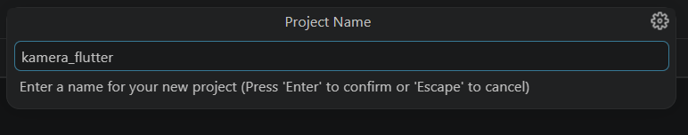

### Langkah 2

Anda memerlukan tiga dependensi pada project flutter untuk menyelesaikan praktikum ini.

camera → menyediakan seperangkat alat untuk bekerja dengan kamera pada device.

path_provider → menyediakan lokasi atau path untuk menyimpan hasil foto.

path → membuat path untuk mendukung berbagai platform.

Untuk menambahkan dependensi plugin, jalankan perintah flutter pub add seperti berikut di terminal:

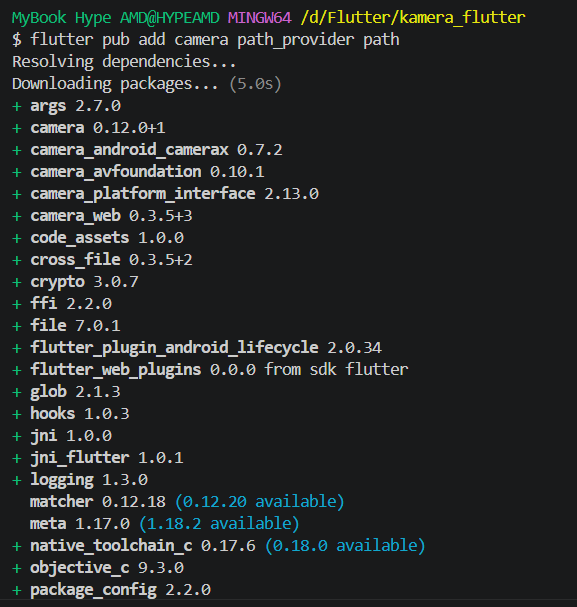

> Tips 
> - Untuk Android, Anda harus update variabel minSdkVersion = 21 (atau lebih tinggi) pada file gradle.
> - Pada iOS, baris kode berikut harus ditambahkan pada file ios/Runner/Info.plist untuk mengakses kamera dan microphone.

``` dart
<key>NSCameraUsageDescription</key>
<string>Explanation on why the camera access is needed.</string>
<key>NSMicrophoneUsageDescription</key>
<string>Explanation on why the microphone access is needed.</string>
```

### Langkah 3: Ambil Sensor Kamera dari device

Selanjutnya, kita perlu mengecek jumlah kamera yang tersedia pada perangkat menggunakan plugin camera seperti pada kode berikut ini. Kode ini letakkan dalam void main().

lib/main.dart

.png)

Ubah void main() menjadi async function seperti berikut ini.

lib/main.dart

.png)

Pastikan melakukan impor plugin sesuai yang dibutuhkan.

### Langkah 4: Buat dan inisialisasi CameraController

Setelah Anda dapat mengakses kamera, gunakan langkah-langkah berikut untuk membuat dan menginisialisasi CameraController. Pada langkah berikut ini, Anda akan membuat koneksi ke kamera perangkat yang memungkinkan Anda untuk mengontrol kamera dan menampilkan pratinjau umpan kamera.

1. Buat StatefulWidget dengan kelas State pendamping.
2. Tambahkan variabel ke kelas State untuk menyimpan CameraController.
3. Tambahkan variabel ke kelas State untuk menyimpan Future yang dikembalikan dari CameraController.initialize().
4. Buat dan inisialisasi controller dalam metode initState().
5. Hapus controller dalam metode dispose().

lib/widget/takepicture_screen.dart

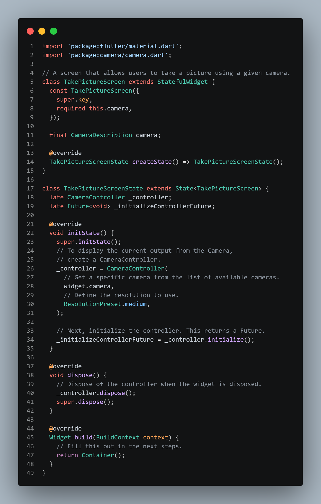

> Perhatian: Jika Anda tidak menginisialisasi CameraController, Anda tidak dapat menggunakan kamera untuk menampilkan pratinjau dan mengambil gambar.

### Langkah 5: Gunakan CameraPreview untuk menampilkan preview foto

Gunakan widget CameraPreview dari package camera untuk menampilkan preview foto. Anda perlu tipe objek void berupa FutureBuilder untuk menangani proses async.

> Perhatian: Pada kode ini Anda perlu logic untuk menunggu controller selesai proses inisialisasi sebelum bekerja dengan kamera. Anda harus menunggu hasil dari method _initializeControllerFuture(), yang telah dibuat sebelumnya, agar dapat menampilkan preview foto dengan CameraPreview.

lib/widget/takepicture_screen.dart

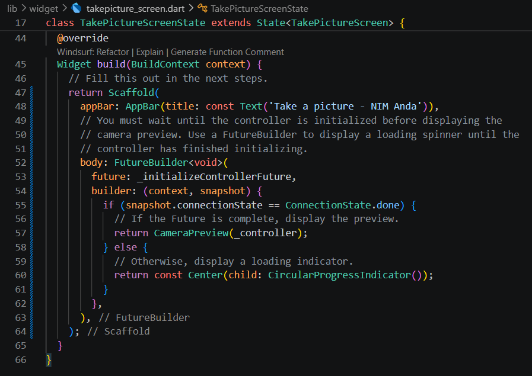

### Langkah 6: Ambil foto dengan CameraController

Anda dapat menggunakan CameraController untuk mengambil gambar menggunakan metode takePicture(), yang mengembalikan objek XFile, merupakan sebuah objek abstraksi File lintas platform yang disederhanakan. Pada Android dan iOS, gambar baru disimpan dalam direktori cache masing-masing, dan path ke lokasi tersebut dikembalikan dalam XFile.

Pada codelab ini, buatlah sebuah FloatingActionButton yang digunakan untuk mengambil gambar menggunakan CameraController saat pengguna mengetuk tombol.

Pengambilan gambar memerlukan 2 langkah:

1. Pastikan kamera telah diinisialisasi.
2. Gunakan controller untuk mengambil gambar dan pastikan ia mengembalikan objek Future.

Praktik baik untuk membungkus operasi kode ini dalam blok try / catch guna menangani berbagai kesalahan yang mungkin terjadi.

Kode berikut letakkan dalam Widget build setelah field body.

lib/widget/takepicture_screen.dart

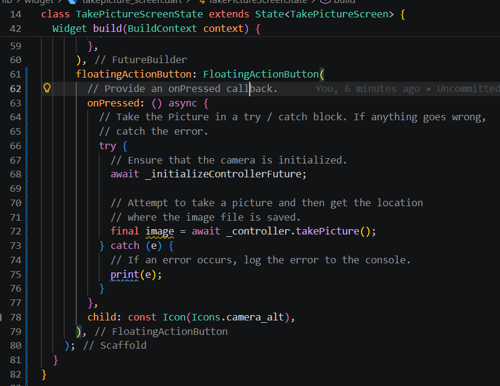

### Langkah 7: Buat widget baru DisplayPictureScreen

Buatlah file baru pada folder widget yang berisi kode berikut.

lib/widget/displaypicture_screen.dart

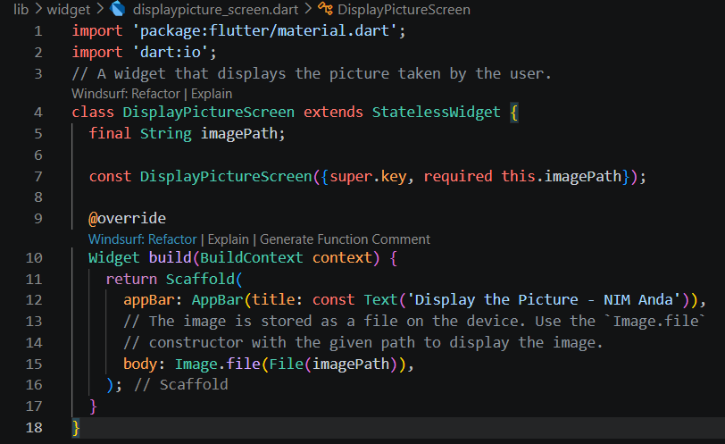

### Langkah 8: Edit main.dart

Edit pada file ini bagian runApp seperti kode berikut.

lib/main.dart

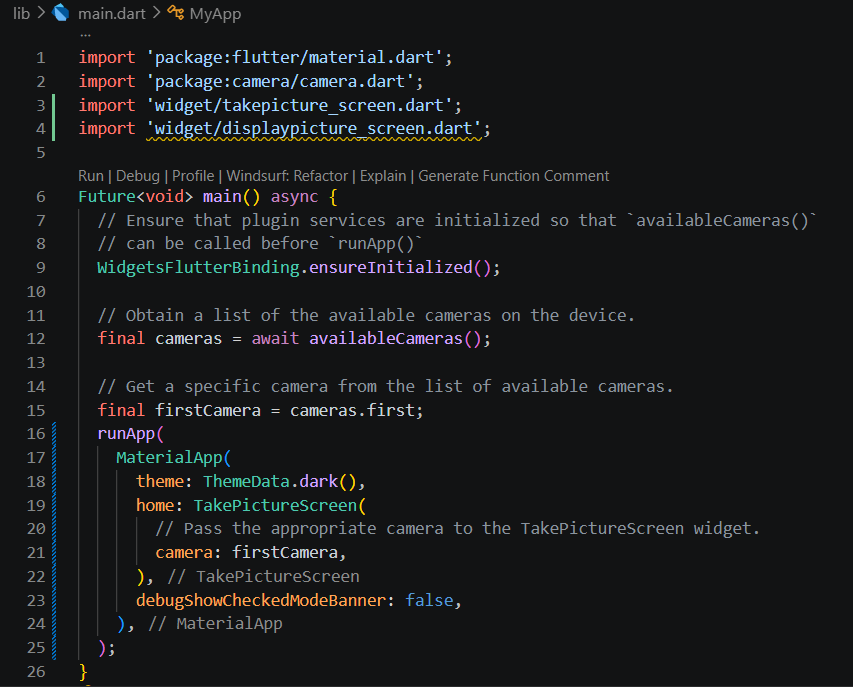

### Langkah 9: Menampilkan hasil foto

Tambahkan kode seperti berikut pada bagian try / catch agar dapat menampilkan hasil foto pada DisplayPictureScreen.

lib/widget/takepicture_screen.dart

.png)

.png)

Silakan deploy pada device atau smartphone Anda dan perhatikan hasilnya!

.png)

---

## Praktikum 2: Membuat photo filter carousel

### Langkah 1: Buat project baru

Buatlah project flutter baru di pertemuan 09 dengan nama photo_filter_carousel

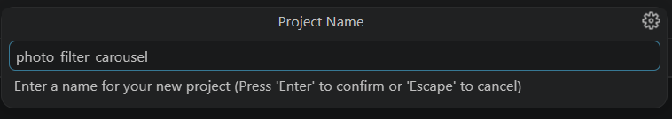

### Langkah 2: Buat widget Selector ring dan dark gradient

Buatlah folder widget dan file baru yang berisi kode berikut.

lib/widget/filter_selector.dart

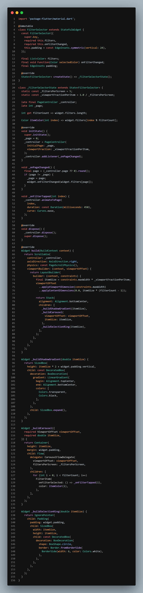

**Perbaikan:**

.png)

### Langkah 3: Buat widget photo filter carousel

Buat file baru di folder widget dengan kode seperti berikut.

lib/widget/filter_carousel.dart

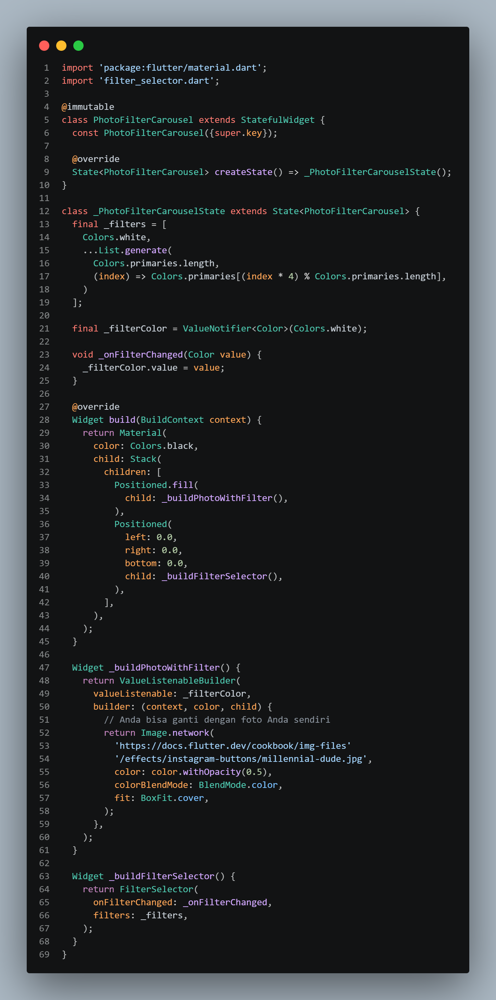

### Langkah 4: Membuat filter warna - bagian 1

Buat file baru di folder widget seperti kode berikut.

lib/widget/carousel_flowdelegate.dart

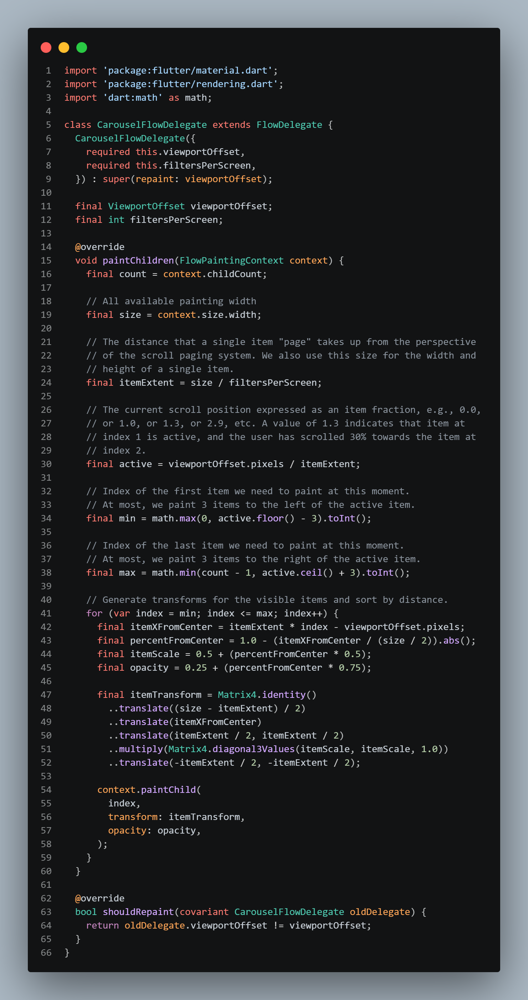

### Langkah 5: Membuat filter warna

Buat file baru di folder widget seperti kode berikut ini.

lib/widget/filter_item.dart

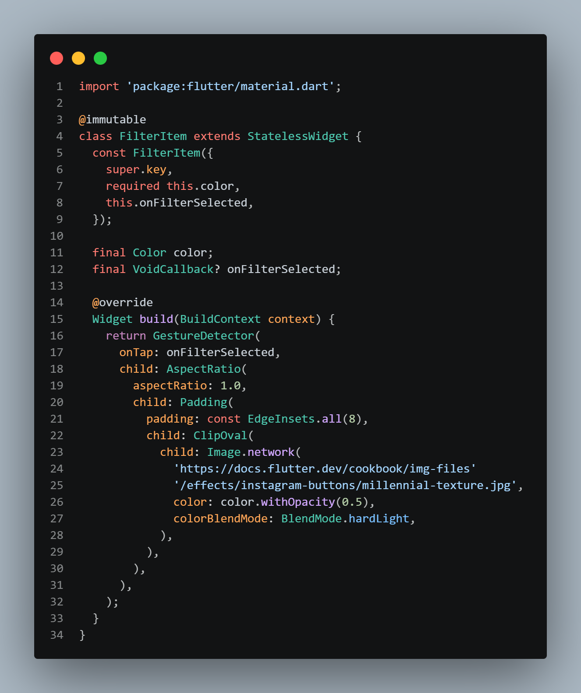

### Langkah 6: Implementasi filter carousel

Terakhir, kita impor widget PhotoFilterCarousel ke main seperti kode berikut ini.

lib/main.dart

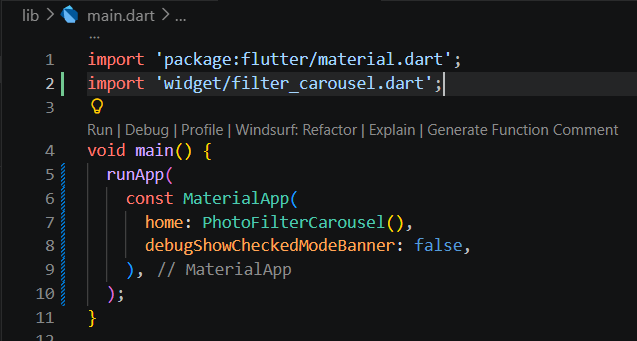

### Troubleshoot

Jika diperlukan, beberapa widget yang telah Anda buat sebelumnya, memerlukan kode import berikut ini.

``` dart
import 'dart:math' as math;

import 'package:flutter/material.dart';
import 'package:flutter/rendering.dart' show ViewportOffset;
```

---

## TUGAS PRAKTIKUM

### 1. Selesaikan Praktikum 1 dan 2, lalu dokumentasikan dan push ke repository Anda berupa screenshot setiap hasil pekerjaan beserta penjelasannya di file README.md! Jika terdapat error atau kode yang tidak dapat berjalan, silakan Anda perbaiki sesuai tujuan aplikasi dibuat!

### 2. Gabungkan hasil praktikum 1 dengan hasil praktikum 2 sehingga setelah melakukan pengambilan foto, dapat dibuat filter carouselnya!

### 3. Jelaskan maksud void async pada praktikum 1?

*jawab:*

Penggunaan Future<void> dan key async digunakan untuk menangani operasi asinkronus saat menginisialisasi perangkat keras kamera. async memungkinkan aplikasi menggunakan perintah await untuk menunggu proses pengambilan data kamera dari perangkat (availableCameras()) hingga selesai tanpa menghentikan jalannya aplikasi. Sementara itu, void menunjukkan bahwa fungsi hanya menjalankan proses inisialisasi tersebut tanpa mengembalikan nilai apa pun setelah selesai.

### 4. Jelaskan fungsi dari anotasi @immutable dan @override ?

*jawab:*

- @immutable: anotasi ini digunakan untuk menandakan bahwa suatu class bersifat tidak dapat diubah (immutable). Artinya, semua atribut di dalam class tersebut harus bersifat final dan nilainya tidak boleh berubah setelah objek dibuat. Tujuannya untuk menjaga konsistensi data dan menghindari perubahan yang tidak disengaja
- @override: anotasi ini digunakan ketika sebuah method menimpa (override) method dari superclass. Fungsinya agar compiler dapat memeriksa apakah method yang ditulis benar-benar sesuai dengan method yang ada di parent class, sehingga membantu mencegah kesalahan penulisan atau ketidaksesuaian. Anotasi ini sering digunakan pada metode seperti build(), initState(), atau dispose()

### 5. Kumpulkan link commit repository GitHub Anda kepada dosen yang telah disepakati!